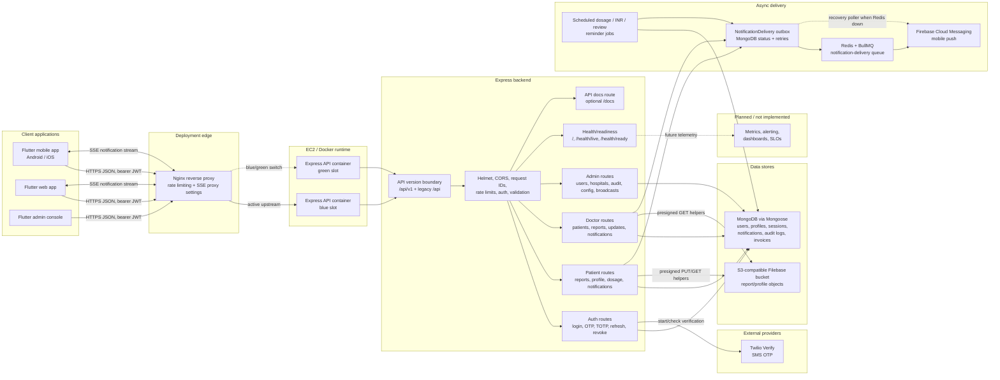
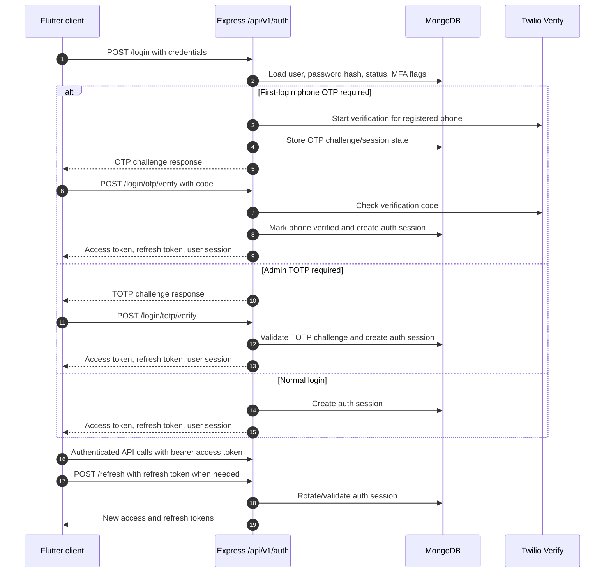
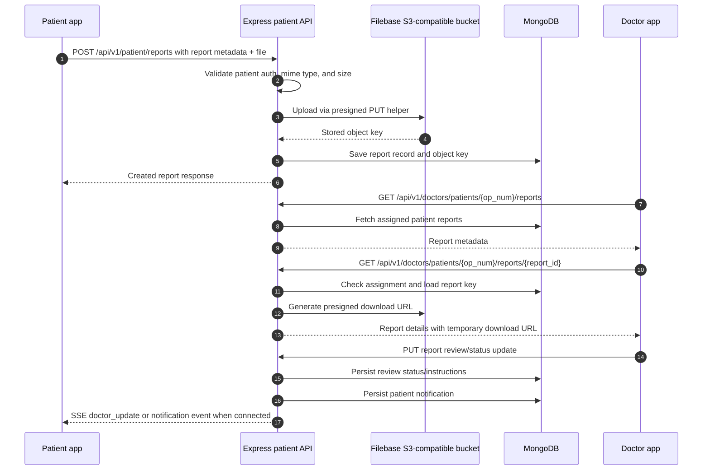
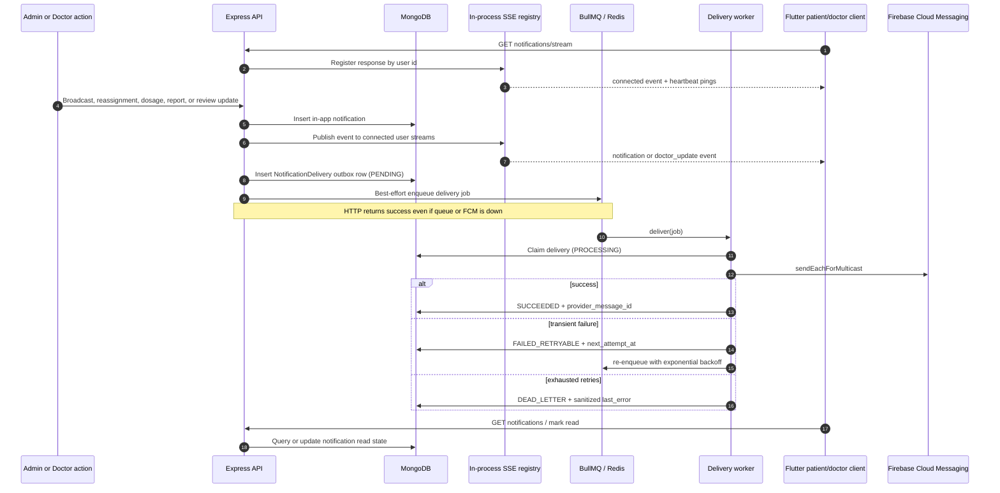

# VitaLink Architecture

This document describes the system that is currently implemented in this
repository. Planned components are called out explicitly so the diagrams do not
blur production behavior with roadmap intent.

## Current Architecture

## Implemented Boundaries

- Clients are Flutter applications for web, Android, and iOS. They call the
  backend over JSON APIs and keep access/refresh tokens in secure storage.
- The backend is an Express API. Versioned traffic is mounted under
  `/api/v1`; legacy `/api` routes are still mounted with deprecation headers.
- The backend uses middleware for request IDs, structured request logging,
  Helmet, CORS, body limits, timeouts, rate limiting, authentication,
  role-based authorization, validation, audit logging, and centralized error
  handling.
- MongoDB is accessed through Mongoose models for users, patient/doctor/admin
  profiles, auth sessions, OTP challenges, notifications, audit logs, hospitals,
  invoices, and system config.
- File storage uses the AWS SDK against the Filebase S3-compatible endpoint.
  Report and profile file flows use one-hour presigned PUT/GET URLs or server
  side upload helpers, and only object keys are stored with domain records.
- Twilio Verify is implemented for patient and doctor first-login phone OTP
  verification. Admin TOTP MFA is implemented separately through backend TOTP
  services.
- In-app notifications are persisted in MongoDB. Patient and doctor clients can
  connect to process-local Server-Sent Events streams for real-time notification
  delivery while the API process is alive.
- Deployment assets describe an EC2-style Docker Compose runtime with blue and
  green backend containers behind Nginx. Nginx rate limits requests and disables
  proxy buffering for SSE streams.
- Liveness is exposed at `/health/live`; readiness is exposed at
  `/health/ready` and checks the Mongoose connection state. Docker healthchecks
  use `/health/ready`.

## Key Data Flows

### Login, OTP, and Session Flow

### Report Upload and Review Flow

### Notification Flow

## Operational Notes

- Request logs are emitted through Morgan into the backend logger with sensitive
  query parameters redacted and an `X-Request-Id` attached to each response.
- Nginx and Docker use json-file logging with size and file-count limits in the
  checked-in deployment compose file.
- Readiness is tied to MongoDB connectivity, so a container can be live but not
  ready while Mongoose is disconnected.
- SSE streams are currently process-local. In a multi-container deployment,
  clients must stay connected to the active upstream process that owns their
  stream; cross-process fanout is a future queue/pub-sub concern.
- Firebase Cloud Messaging is integrated behind `FCM_ENABLED`. Doctor-update
  pushes are written to a durable `NotificationDelivery` outbox and processed by
  a BullMQ worker when `REDIS_URL` is set. Mongo owns attempts, backoff,
  dead-letter state, and retention TTL. If Redis is unavailable the outbox row
  remains queryable and a recovery poller drains due rows best-effort.
- Monitoring dashboards, alerting, and SLO reporting remain roadmap items.
  In-process delivery counters and structured logs (`notification_delivery.*`)
  provide baseline operational visibility.
