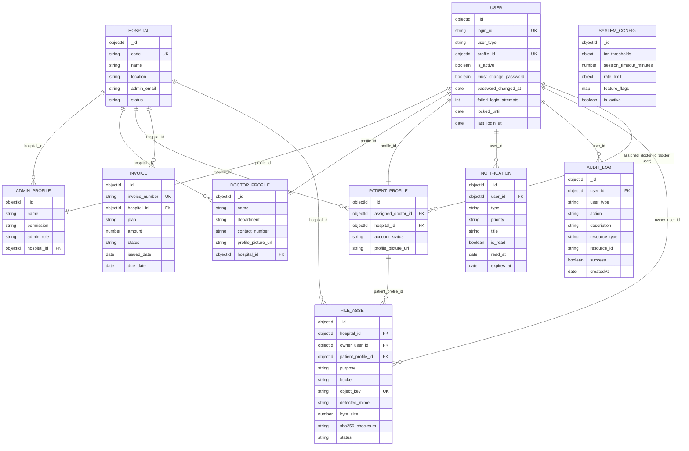

# VitaLink Data Model Documentation

Last updated: 2026-07-10

## Purpose

This document describes the current backend persistence model implemented in `backend/src/models`, the relationships between collections, the existing index footprint, the unique-key inventory, and the recommended migration policy for controlled schema evolution.

This is an implementation-aligned document, not a target-state wish list. Where the code has gaps or ambiguity, those are called out explicitly.

## Technology and Modeling Conventions

- Database: MongoDB
- ODM: Mongoose
- Primary identifiers: MongoDB `ObjectId`
- Cross-collection references: stored as `ObjectId` and resolved with Mongoose `populate`
- Audit and notification event detail: stored partly as embedded `Mixed` payloads for flexibility
- Time fields: persisted as UTC-capable MongoDB `Date`
- Embedded subdocuments: used for patient clinical history, dosage schedules, INR history, and health logs

## Entity Relationship Overview

## Collection Catalog

### `users`

System authentication identity for every actor in the platform.

Key fields:

| Field | Type | Required | Notes |
|---|---|---:|---|
| `login_id` | string | Yes | Unique login identifier; trimmed before validation |
| `password` | string | Yes | Salted and hashed in pre-validation hook |
| `salt` | string | Yes | Per-user salt |
| `user_type` | enum | Yes | `ADMIN`, `DOCTOR`, `PATIENT` |
| `profile_id` | ObjectId | Yes | Unique reference to role-specific profile |
| `user_type_model` | string | Yes | Derived discriminator-like ref target |
| `is_active` | boolean | No | Default `true` |
| `must_change_password` | boolean | No | Default `false` |
| `password_changed_at` | date | No | Updated whenever the password hash changes |
| `password_history` | array | No | Hidden salted/hash history entries used to block recent password reuse |
| `failed_login_attempts` | number | No | Default `0` |
| `locked_until` | date | No | Temporary lockout marker |
| `last_login_at` | date | No | Operational telemetry |
| `last_failed_login_at` | date | No | Operational telemetry |
| `admin_mfa.totp.status` | enum | No | Admin-only authenticator state: `DISABLED`, `PENDING`, `ENABLED` |
| `admin_mfa.totp.secret_ciphertext` | string | No | Encrypted active TOTP secret for enabled admins |
| `admin_mfa.totp.pending_secret_ciphertext` | string | No | Encrypted pending TOTP setup secret before activation |
| `admin_mfa.totp.last_verified_time_step` | number | No | Replay guard for admin login TOTP verification |

Security notes:

- Passwords are never returned by `toJSON()`.
- Password history stores only previous salted password hashes plus salts and change timestamps; it is hidden from default queries and JSON serialization.
- Password expiry defaults to `PASSWORD_EXPIRY_DAYS=90`; `PASSWORD_HISTORY_COUNT=5` controls how many previous passwords are retained and checked.
- `profile_id` is a one-to-one link to the owning role profile.
- `user_type_model` is computed from `user_type` and is used by Mongoose `refPath`.
- Admin TOTP secrets are stored encrypted with AES-GCM using `ADMIN_TOTP_ENCRYPTION_KEY` when configured.

### `adminprofiles`

Administrative profile for app admins, hospital admins, and auditors.

Key fields:

| Field | Type | Required | Notes |
|---|---|---:|---|
| `name` | string | No | Defaults to `Admin User` |
| `permission` | enum | No | `FULL_ACCESS`, `READ_ONLY`, `LIMITED_ACCESS` |
| `admin_role` | enum | No | `app_admin`, `hospital_admin`, `auditor` |
| `hospital_id` | ObjectId | No | Optional tenant scope for hospital admins |

### `adminmfachallenges`

Short-lived admin authenticator-app login challenge.

Key fields:

| Field | Type | Required | Notes |
|---|---|---:|---|
| `user_id` | ObjectId | Yes | References an admin `users` record |
| `user_type` | enum | Yes | Always `ADMIN` |
| `status` | enum | No | `PENDING`, `VERIFIED`, `EXPIRED`, `LOCKED`, `CANCELLED` |
| `expires_at` | date | Yes | TTL indexed challenge expiration |
| `attempt_count` | number | No | Failed verification attempts |
| `max_attempts` | number | Yes | Defaults from `ADMIN_TOTP_MAX_ATTEMPTS` |
| `verified_at` | date | No | Set after successful TOTP verification |

### `doctorprofiles`

Clinical provider profile linked one-to-one with a `users` record.

Key fields:

| Field | Type | Required | Notes |
|---|---|---:|---|
| `name` | string | Yes | Doctor display name |
| `department` | string | No | Defaults to `Cardiology` |
| `contact_number` | string | No | Primary SMS phone number; API account creation/update paths require exactly 10 digits |
| `phone_verification.status` | enum | No | `PENDING` or `VERIFIED`; defaults to `PENDING` for OTP groundwork |
| `phone_verification.verified_at` | date | No | Set when phone verification succeeds |
| `profile_picture_url` | string | No | Stores object key, later resolved to presigned URL |
| `profile_picture_file_asset_id` | ObjectId | No | References tenant-scoped `fileassets`; absent on legacy records until backfill |
| `hospital_id` | ObjectId | No | Tenant ownership anchor |

### `patientprofiles`

Primary clinical and operational patient record.

Key fields:

| Field | Type | Required | Notes |
|---|---|---:|---|
| `assigned_doctor_id` | ObjectId | No | References doctor `users._id`, not `doctorprofiles._id` |
| `hospital_id` | ObjectId | No | Tenant ownership anchor |
| `demographics` | object | Partly | Contains patient and next-of-kin data |
| `medical_config` | object | No | Care-plan state and thresholds |
| `medical_history` | array | No | Embedded condition history |
| `weekly_dosage` | object | No | Embedded dosage schedule by weekday |
| `inr_history` | array | No | Embedded report/event history |
| `health_logs` | array | No | Embedded self-reported health updates |
| `account_status` | enum | No | `Active`, `Discharged`, `Deceased` |
| `profile_picture_url` | string | No | Stores object key, later resolved to presigned URL |
| `profile_picture_file_asset_id` | ObjectId | No | References tenant-scoped `fileassets`; absent on legacy records until backfill |

Embedded structures:

`demographics`

| Field | Type | Notes |
|---|---|---|
| `name` | string | Required |
| `age` | number | Optional |
| `gender` | enum | `Male`, `Female`, `Other` |
| `phone` | string | Primary SMS phone number; API account creation/update paths require exactly 10 digits |
| `phone_verification.status` | enum | Defaults to `PENDING` for OTP groundwork |
| `phone_verification.verified_at` | date | Set when phone verification succeeds |
| `next_of_kin.name` | string | Optional |
| `next_of_kin.relation` | string | Optional |
| `next_of_kin.phone` | string | Optional |

`medical_config`

| Field | Type | Notes |
|---|---|---|
| `diagnosis` | string | Optional |
| `therapy_drug` | string | Optional |
| `therapy_start_date` | date | Optional |
| `target_inr.min` | number | Default `2.0` |
| `target_inr.max` | number | Default `3.0` |
| `next_review_date` | date | Optional |
| `instructions` | string[] | Optional |
| `taken_doses` | date[] | Optional |

`weekly_dosage`

- Seven numeric weekday fields: `monday` through `sunday`
- Stored as an embedded object with `_id: false`

`inr_history`

| Field | Type | Notes |
|---|---|---|
| `test_date` | date | Required |
| `uploaded_at` | date | Defaults to current time |
| `inr_value` | number | Required |
| `is_critical` | boolean | Default `false` |
| `file_url` | string | S3-compatible object key |
| `file_asset_id` | ObjectId | Tenant-scoped `fileassets` reference for authorization and metadata |
| `notes` | string | Doctor-added note |

`health_logs`

| Field | Type | Notes |
|---|---|---|
| `date` | date | Defaults to current time |
| `type` | enum | Validator-driven value set |
| `description` | string | Required |
| `feedback` | string/boolean-ish | Code currently defaults this field to `false`, which is a schema inconsistency to fix |

Important implementation note:

- Doctor and admin flows use patient `login_id` as an `op_num` route identifier. That identifier is not stored on `patientprofiles`; it is the patient's `users.login_id`. This should be treated as a contract rule in API integrations.

### `fileassets`

Tenant-scoped storage metadata and authorization anchor for uploaded clinical reports and profile images. New uploads create this record before the owning profile/report reference is committed; legacy object-key-only records remain readable until backfilled.

| Field | Type | Required | Notes |
|---|---|---:|---|
| `hospital_id` | ObjectId | Yes | Tenant boundary used during every new asset lookup |
| `owner_user_id` | ObjectId | Yes | User that owns the file |
| `patient_profile_id` | ObjectId | No | Patient context for INR reports and patient profile pictures |
| `purpose` | enum | Yes | `INR_REPORT`, `PATIENT_PROFILE_PICTURE`, `DOCTOR_PROFILE_PICTURE` |
| `storage_provider` | enum | Yes | Currently `S3_COMPATIBLE` |
| `bucket` | string | Yes | Storage bucket |
| `object_key` | string | Yes | UUID-based key with byte-detected safe extension |
| `original_filename` | string | Yes | Client filename retained as metadata only; never used as authorization |
| `detected_mime` | string | Yes | MIME derived from magic bytes |
| `byte_size` | number | Yes | Server-observed buffer length |
| `sha256_checksum` | string | Yes | Lowercase SHA-256 of server-side bytes |
| `status` | enum | Yes | `ACTIVE`, `FAILED`, `DELETED` |
| `created_by` | ObjectId | Yes | User that initiated upload/backfill ownership |
| `failure_reason` | string | No | Compensation/cleanup failure detail |
| `deleted_at` | date | No | Soft deletion/compensation marker |
| `retention_eligible_at` | date | No | Reserved for the later retention policy |

New download resolution requires matching asset ID, hospital, owner, purpose, patient context when applicable, active status, and no deletion marker. Only owning records without an asset ID may use the isolated legacy object-key fallback.

The legacy fallback also requires an exact requester/owner tenant match and a reference timestamp before the immutable `FILE_ASSET_LEGACY_CUTOFF_AT` deployment boundary. Current APIs cannot write raw profile-picture keys. Profile-picture replacement uses compare-and-set semantics and retires the previously referenced active asset so concurrent replacements do not silently create active orphan objects.

Staging and production must supply that cutoff explicitly as a valid ISO timestamp. Operators set it to the coordinated instant when all older key-only application instances have been drained; the new application fails startup when it is missing or invalid. The rollout and backfill order is documented in `backend/docs/api-reference.md`.

### `hospitals`

Tenant anchor for hospital-scoped administration, doctors, and patients.

Key fields:

| Field | Type | Required | Notes |
|---|---|---:|---|
| `code` | string | Yes | Unique, trimmed, uppercased |
| `name` | string | Yes | Hospital name |
| `location` | string | Yes | Geographic/site descriptor |
| `admin_email` | string | Yes | Lowercased contact email; not unique today |
| `status` | enum | No | `active`, `suspended`, `inactive` |
| `metadata` | mixed | No | Free-form extension field |

### `invoices`

Billing record for hospital plans and payment state.

Key fields:

| Field | Type | Required | Notes |
|---|---|---:|---|
| `invoice_number` | string | Yes | Unique business identifier |
| `hospital_id` | ObjectId | Yes | Invoice tenant |
| `plan` | string | Yes | Plan label |
| `amount` | number | Yes | Non-negative |
| `status` | enum | No | `Pending`, `Paid`, `Overdue` |
| `issued_date` | date | No | Defaults to current time |
| `due_date` | date | Yes | Due date |
| `payment_metadata` | mixed | No | Payment provider data |

### `notifications`

Persisted in-app notification store used by both standard notifications and doctor-change events.

Key fields:

| Field | Type | Required | Notes |
|---|---|---:|---|
| `user_id` | ObjectId | Yes | Notification recipient |
| `type` | enum | Yes | Includes `DOCTOR_UPDATE`, `GENERAL`, `SYSTEM_ANNOUNCEMENT`, etc. |
| `priority` | enum | No | `LOW`, `MEDIUM`, `HIGH`, `URGENT` |
| `title` | string | Yes | Short headline |
| `message` | string | Yes | Message body |
| `data` | mixed | No | Optional structured metadata |
| `is_read` | boolean | No | Default `false` |
| `read_at` | date | No | Read timestamp |
| `action_url` | string | No | Optional deep link |
| `expires_at` | date | No | Used by TTL auto-expiry index |

### `notificationdeliveries`

Durable push-delivery outbox. One row per in-app notification + channel + provider.
Clinical HTTP paths write this row after the in-app notification; a BullMQ worker
(or recovery poller) performs FCM send, retries, and dead-letter transitions.

Key fields:

| Field | Type | Required | Notes |
|---|---|---:|---|
| `notification_id` | ObjectId | Yes | Parent in-app notification |
| `user_id` | ObjectId | Yes | Push recipient |
| `channel` | enum | Yes | Currently `FCM` |
| `provider` | enum | Yes | Currently `FIREBASE` |
| `status` | enum | Yes | `PENDING`, `QUEUED`, `PROCESSING`, `SUCCEEDED`, `FAILED_RETRYABLE`, `DEAD_LETTER`, `SKIPPED` |
| `attempts` | number | No | Successful claim count |
| `max_attempts` | number | No | Default 5; exhausted rows become `DEAD_LETTER` |
| `next_attempt_at` | date | No | Due time for claim/retry |
| `provider_message_id` | string | No | First FCM message id on success |
| `last_error` | string | No | Sanitized, max 500 chars; no tokens/secrets |
| `idempotency_key` | string | Yes | Unique `{notificationId}:FCM:FIREBASE` |
| `title` / `body` | string | Yes | Push copy (length-capped) |
| `data` | map of string | No | FCM data payload only |
| `completed_at` | date | No | Set on terminal status |
| `expires_at` | date | Yes | TTL retention (default 30 days) |

Indexes: unique `idempotency_key`; `{ status, next_attempt_at }`; TTL on `expires_at`.

### `auditlogs`

Security and operational audit trail for admin and authentication activity.

Key fields:

| Field | Type | Required | Notes |
|---|---|---:|---|
| `user_id` | ObjectId | Yes | Actor |
| `user_type` | string | Yes | Actor type |
| `action` | enum | Yes | Includes login, logout, reset, reassignment, config updates, etc. |
| `description` | string | Yes | Human-readable event summary |
| `resource_type` | string | No | Logical resource name |
| `resource_id` | string | No | Logical resource identifier |
| `previous_data` | mixed | No | Before-state snapshot |
| `new_data` | mixed | No | After-state snapshot |
| `ip_address` | string | No | Source IP |
| `user_agent` | string | No | Client user agent |
| `success` | boolean | No | Default `true` |
| `error_message` | string | No | Failure detail |
| `metadata` | mixed | No | Additional structured context |

Password reset audit records include `metadata.invalidated_sessions` and `metadata.revocation_reason` when active target-user sessions are revoked. Login attempt audit records include `metadata.login_attempt.normalized_login_id`, `metadata.login_attempt.ip_address`, request ID, and outcome for forensic lookup.

### `systemconfigs`

Operational runtime configuration collection.

Key fields:

| Field | Type | Required | Notes |
|---|---|---:|---|
| `inr_thresholds.critical_low` | number | No | Default `1.5` |
| `inr_thresholds.critical_high` | number | No | Default `4.5` |
| `session_timeout_minutes` | number | No | Default `30` |
| `rate_limit.max_requests` | number | No | Default `100` |
| `rate_limit.window_minutes` | number | No | Default `15` |
| `feature_flags` | map<boolean> | No | Runtime feature toggles |
| `is_active` | boolean | No | Active config selector |

## Unique Key Inventory

The following uniqueness guarantees exist in the current implementation.

| Collection | Field(s) | Constraint Type | Business Meaning |
|---|---|---|---|
| `users` | `login_id` | Unique index | One login identity per username/OP number/email-style identifier |
| `users` | `profile_id` | Unique index | One authentication account per role profile |
| `hospitals` | `code` | Unique index | One tenant code per hospital |
| `invoices` | `invoice_number` | Unique index | One billing identifier per invoice |
| `fileassets` | `{ bucket, object_key }` | Unique compound index | One metadata record per stored object |

Current gaps:

- `hospitals.admin_email` is required but not unique.
- No unique patient business key exists inside `patientprofiles`; operational uniqueness depends on `users.login_id`.

## Index Strategy

### Existing indexes implemented in code

| Collection | Index | Purpose |
|---|---|---|
| `users` | `{ login_id: 1 }` unique | Login lookup and uniqueness |
| `users` | `{ profile_id: 1 }` unique | One-to-one profile mapping |
| `users` | `{ locked_until: 1 }` | Lockout-state inspection |
| `adminprofiles` | `{ admin_role: 1 }` | Role-based admin filtering |
| `doctorprofiles` | `{ hospital_id: 1 }` | Tenant-scoped doctor filtering |
| `patientprofiles` | `{ assigned_doctor_id: 1 }` | Doctor-owned patient queries |
| `patientprofiles` | `{ hospital_id: 1 }` | Tenant-scoped patient queries |
| `hospitals` | `{ status: 1, createdAt: -1 }` | Status-filtered hospital listing |
| `hospitals` | `{ location: 1 }` | Location filtering |
| `invoices` | `{ hospital_id: 1 }` | Tenant-scoped invoice queries |
| `invoices` | `{ status: 1, due_date: 1 }` | Billing aging and collections workflows |
| `notifications` | `{ expires_at: 1 }` TTL | Automatic expiry removal |
| `notifications` | `{ user_id: 1, is_read: 1, createdAt: -1 }` | Inbox pagination and unread filtering |
| `auditlogs` | `{ user_id: 1, createdAt: -1 }` | Actor timeline lookups |
| `auditlogs` | `{ action: 1, createdAt: -1 }` | Action-type investigations |
| `auditlogs` | `{ resource_type: 1, resource_id: 1 }` | Resource audit tracing |
| `auditlogs` | `{ success: 1, createdAt: -1 }` | Failure and anomaly review |
| `fileassets` | `{ hospital_id: 1, purpose: 1, createdAt: -1 }` | Tenant/purpose history |
| `fileassets` | `{ owner_user_id: 1, createdAt: -1 }` | Owner file history |
| `fileassets` | `{ patient_profile_id: 1, createdAt: -1 }` | Patient clinical file history |
| `fileassets` | `{ bucket: 1, object_key: 1 }` unique | Storage identity and idempotent backfill |
| `fileassets` | `{ status: 1 }` | Cleanup and failed-delivery operations |

### How the current indexes support the application

- Authentication relies on unique `users.login_id`.
- Doctor dashboards rely on `patientprofiles.assigned_doctor_id`.
- Multi-tenant admin workflows rely on `hospital_id` indexes in doctor, patient, and invoice collections.
- Notifications rely on `user_id + is_read + createdAt` for paginated inbox views and unread counts.
- Notification expiry is automatically enforced by MongoDB TTL on `expires_at`.
- Audit investigations can pivot by actor, action type, resource, or success/failure.

### Recommended next indexes

The following are not yet implemented, but should be considered before scale-out:

| Collection | Proposed Index | Reason |
|---|---|---|
| `users` | `{ user_type: 1, is_active: 1 }` | Faster user-admin listing and broadcast targeting |
| `patientprofiles` | `{ hospital_id: 1, assigned_doctor_id: 1 }` | Common tenant + doctor access pattern |
| `patientprofiles` | `{ account_status: 1, hospital_id: 1 }` | Status-based operational filtering |
| `notifications` | `{ user_id: 1, createdAt: -1 }` | Read-agnostic inbox scans |
| `auditlogs` | `{ createdAt: -1 }` | Time-bounded export and retention operations |
| `hospitals` | `{ admin_email: 1 }` | Faster admin lookups and potential future uniqueness |

Index governance guidance:

- Every new index should have a documented query it serves.
- Avoid indexing deeply embedded, high-churn arrays unless query evidence justifies it.
- Re-check index selectivity once real production traffic is available.

## Data Classification and Sensitivity

### High-sensitivity fields

These should be treated as PHI/PII or security-sensitive data:

- `users.password`
- `users.salt`
- `users.password_history`
- `users.login_id` when it represents a patient OP number or personal login
- `doctorprofiles.contact_number`
- `patientprofiles.demographics.*`
- `patientprofiles.demographics.next_of_kin.*`
- `patientprofiles.medical_config.*`
- `patientprofiles.medical_history`
- `patientprofiles.inr_history`
- `patientprofiles.health_logs`
- `notifications.message` and `notifications.data` when they contain clinical context
- `auditlogs.previous_data`, `auditlogs.new_data`, `auditlogs.metadata`
- `hospitals.admin_email`

### Operational handling expectations

- Do not log raw passwords, salts, tokens, or presigned URLs.
- Avoid returning full audit payload snapshots to low-privilege clients.
- Treat object storage keys as sensitive metadata because they map to patient artifacts.

## Referential Integrity Rules

MongoDB does not enforce foreign keys natively, so the application layer must preserve these invariants:

- Every `users.profile_id` must reference exactly one role-specific profile.
- `patientprofiles.assigned_doctor_id` must reference a doctor user record, not a doctor profile record.
- Tenant-bound profiles should reference a valid `hospitals._id`.
- `notifications.user_id` and `auditlogs.user_id` should always point to an existing user unless a deliberate retention/archive policy says otherwise.
- Every active `fileassets` record must match its owning profile/report reference, tenant, owner, purpose, bucket, byte size, and checksum.

Deletion policy expectations:

- Prefer soft deactivation at the `users.is_active` layer over hard deletion.
- Do not hard-delete profiles without a documented cascade strategy for audit, notifications, and file objects.

## Migration Policy

### Current state

The repository currently uses script-based migrations in `backend/src/scripts` rather than a formal migration framework. Existing examples include:

- `migrateAssignedDoctorIds.ts`
- `migrateDoctorChangeEventsToNotifications.ts`
- `migrateInrCriticalFlags.ts`
- `backfillFileAssets.ts` (dry-run by default; requires `--execute` for writes)

The FileAsset backfill dry run reads each candidate object, validates its byte signature, and computes metadata without database writes. Its summary distinguishes would-create/would-attach counts from executed writes; reruns reuse only matching active assets and reject ownership conflicts.

This is workable for a small system, but it needs operating rules.

### Required migration standard

1. All schema or data migrations must be forward-only and idempotent where practical.
2. Every migration must have:
   - purpose
   - affected collections
   - preconditions
   - rollback posture
   - verification query
3. Destructive data rewrites must run only after a backup or restore point is confirmed.
4. Application code should support a safe compatibility window during rolling deployment whenever possible.
5. Migrations touching tenant or clinical data must emit an auditable execution record.

### Recommended migration workflow

1. Add code that is backward-compatible with both old and new document shapes.
2. Deploy the compatible application version.
3. Run the migration script in a controlled environment.
4. Verify document counts, null rates, and sample records.
5. Remove legacy compatibility code only after verification succeeds in all environments.

### Naming convention

Use a timestamped, intent-revealing filename pattern:

- `YYYYMMDDHHMM-description.ts`

Example:

- `202607051030-backfill-hospital-id-on-patient-profiles.ts`

### Migration template requirements

Each migration script should include:

- dry-run support where feasible
- structured logging
- batch processing for large collections
- explicit exit code behavior
- post-run summary with `matched`, `modified`, `failed`, and `skipped`

## Known Gaps and Risks

- No formal ERD or schema registry existed before this document.
- The `health_logs.feedback` field has a type/default inconsistency and should be normalized.
- Patient business identity is split between `users.login_id` and `patientprofiles._id`, which increases integration ambiguity.
- No dedicated file metadata collection exists yet; file references are embedded as storage keys inside profile documents.
- No retention indexes exist for audit data, file data, or inactive patient archival.
- Tenant scoping is implemented in service logic, but not all collections encode tenant context strongly enough for future large-scale analytics and exports.

## Recommended Next Artifacts

- `backend/docs/schema-change-checklist.md`
- `backend/docs/retention-and-purge-policy.md`
- `backend/docs/file-asset-model-proposal.md`
- machine-readable OpenAPI contract linked to the data model sections that reference API payloads
