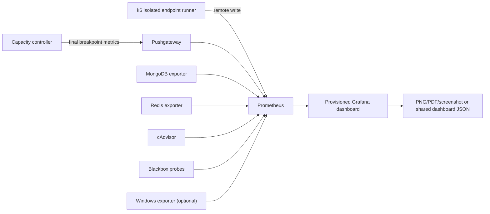

# Capacity observability and mentor reporting

This stack adds live and durable capacity evidence to the guarded VitaLink load
test environment. It is an overlay: the existing MongoDB, Redis, provider stub,
and Nginx definitions remain authoritative.

It provides:

- Prometheus ingestion for k6 remote write;
- a Pushgateway for finalized per-endpoint breakpoint results;
- cAdvisor metrics for containers in the isolated Compose project;
- MongoDB and Redis exporters;
- blackbox probes for Nginx health, API liveness, and API readiness;
- the guarded API `/load-test/metrics` endpoint for Node process and server metrics;
- an optional Windows exporter scrape for the host-run Node process and host;
- a provisioned Grafana dashboard named **VitaLink Endpoint Capacity**.

The dashboard separates live ramp evidence from finalized capacity claims.
“Safe maximum concurrent VUs” is populated only when the controller publishes
a repeatable passing breakpoint; it is never inferred from a smoke run or from
the highest VU value observed.

## Architecture



## Start the stack

From the repository root in PowerShell:

```powershell
$env:LOAD_TEST_GRAFANA_ADMIN_PASSWORD = '<unique-local-password>'
docker compose -p vitalink-load-test `
  -f deploy/load-test/docker-compose.yml `
  -f deploy/load-test/observability/docker-compose.observability.yml `
  up -d
```

The local-only endpoints are:

- Grafana: `http://127.0.0.1:13000`
- Prometheus: `http://127.0.0.1:19090`
- Pushgateway: `http://127.0.0.1:19091`
- cAdvisor: `http://127.0.0.1:18082`

All published ports bind to loopback. Grafana anonymous access and user
registration are disabled. Change the local Grafana password before starting.

Before accepting capacity evidence, verify Prometheus targets at
`http://127.0.0.1:19090/targets`. The required jobs are `prometheus`,
`capacity-results`, `load-test-containers`, `mongodb`, `redis`, and
`load-test-http-probes`. The `vitalink-api-process` target is required for a
capacity run. Start the isolated backend with `NODE_ENV` set to a non-production
value plus `LOAD_TEST_IDENTITY_ENABLED=true` and
`LOAD_TEST_METRICS_ENABLED=true`. The endpoint remains disabled in production
and when either explicit switch is absent. `windows-host` is optional.

## Send k6 metrics to Prometheus

Set these variables in the same shell that launches k6:

```powershell
$env:K6_PROMETHEUS_RW_SERVER_URL = 'http://127.0.0.1:19090/api/v1/write'
$env:K6_PROMETHEUS_RW_TREND_STATS = 'p(50),p(90),p(95),p(99),min,max'
$env:K6_PROMETHEUS_RW_STALE_MARKERS = 'true'
```

Add the output to the existing k6 command:

```powershell
docker run --rm --network host `
  -e K6_PROMETHEUS_RW_SERVER_URL `
  -e K6_PROMETHEUS_RW_TREND_STATS `
  -e K6_PROMETHEUS_RW_STALE_MARKERS `
  grafana/k6:2.1.0 run -o experimental-prometheus-rw <runner.js>
```

When k6 runs inside the `vitalink-load-test` Compose network, use
`http://prometheus:9090/api/v1/write` instead. On Docker Desktop, a k6 container
that is not attached to that network should use
`http://host.docker.internal:19090/api/v1/write`; do not assume Linux
`--network host` semantics on Windows.

The checked-in load client supplies bounded labels such as `load_run_id`,
`endpoint_id`, `method`, `route_family`, `role`, and `threshold_class`. Never add
patient IDs, access tokens, request IDs, raw paths containing record IDs, email
addresses, or phone numbers as Prometheus labels.

## Final breakpoint metric contract

After the controller verifies the last passing step repeatedly and observes the
first failing step, it publishes these gauges:

- `vitalink_endpoint_safe_max_vus`
- `vitalink_endpoint_first_failed_vus`
- `vitalink_endpoint_safe_max_rps`
- `vitalink_endpoint_safe_p95_ms`
- `vitalink_endpoint_safe_p99_ms`
- `vitalink_endpoint_capacity_pass` (`1` only for a complete valid result)

Required labels are `load_run_id`, `endpoint_id`, `method`, and `route_family`.
An optional `failure_reason` must use a bounded enumeration such as
`latency_slo`, `http_error_budget`, `semantic_error`, `dropped_iterations`,
`resource_saturation`, `dependency_unhealthy`, `crash`, or `ceiling_reached`.
Do not place error text in a label.

Example payload for one completed endpoint:

```text
# TYPE vitalink_endpoint_safe_max_vus gauge
vitalink_endpoint_safe_max_vus{load_run_id="mentor_20260724",endpoint_id="get_api_v1_health_ready",method="get",route_family="operational"} 80
# TYPE vitalink_endpoint_first_failed_vus gauge
vitalink_endpoint_first_failed_vus{load_run_id="mentor_20260724",endpoint_id="get_api_v1_health_ready",method="get",route_family="operational",failure_reason="latency_slo"} 88
# TYPE vitalink_endpoint_safe_max_rps gauge
vitalink_endpoint_safe_max_rps{load_run_id="mentor_20260724",endpoint_id="get_api_v1_health_ready",method="get",route_family="operational"} 1240
# TYPE vitalink_endpoint_safe_p95_ms gauge
vitalink_endpoint_safe_p95_ms{load_run_id="mentor_20260724",endpoint_id="get_api_v1_health_ready",method="get",route_family="operational"} 74
# TYPE vitalink_endpoint_safe_p99_ms gauge
vitalink_endpoint_safe_p99_ms{load_run_id="mentor_20260724",endpoint_id="get_api_v1_health_ready",method="get",route_family="operational"} 111
# TYPE vitalink_endpoint_capacity_pass gauge
vitalink_endpoint_capacity_pass{load_run_id="mentor_20260724",endpoint_id="get_api_v1_health_ready",method="get",route_family="operational"} 1
```

Publish it with an HTTP `PUT` to:

```text
http://127.0.0.1:19091/metrics/job/vitalink_capacity/run_id/<url-encoded-run-id>/endpoint_id/<url-encoded-endpoint-id>
```

Delete a run from Pushgateway before repeating the same run ID. Prefer a new
unique run ID; never overwrite a prior mentor report.

## What to capture for the mentor

Select one run ID in Grafana and use a fixed absolute time window. Capture:

1. safe maximum VUs and first failed VUs by endpoint;
2. achieved RPS at the safe step;
3. p95 and p99 latency during that step;
4. HTTP and semantic failure ratios;
5. dropped iterations;
6. Nginx/API liveness and readiness;
7. MongoDB and Redis connection pressure;
8. container CPU and memory;
9. host CPU, memory, event-loop lag, and Node process metrics when available;
10. the exact SLO, step duration, search ceiling, test host specification, Git
    revision, run ID, and any endpoints excluded from valid-mutation testing.

Grafana OSS supports dashboard JSON export and panel/dashboard sharing links.
For a portable artifact, use the browser print dialog to save the fixed-time
dashboard as PDF, or capture full-resolution panel PNGs. Also retain:

- the dashboard JSON from
  `deploy/load-test/observability/grafana/dashboards/vitalink-endpoint-capacity.json`;
- Prometheus data for the approved retention window;
- the controller’s HTML, CSV, Markdown, and machine-readable JSON reports;
- the fixture cleanup reconciliation result.

A screenshot or dashboard alone is not proof of capacity. The report must state
that the “maximum” is the highest tested, repeatable SLO-compliant value within
the authorized ceiling, not an unlimited physical maximum.

The current fixture context shares one authenticated session per role across
VUs. Until per-VU account/session pools are generated, label results as
concurrent virtual users, not distinct logged-in users.

## Optional host and API metrics

The Node API currently runs on the Windows host while the dependencies run in
Docker Desktop. cAdvisor therefore measures the isolated containers but not the
host Node process.

For a defensible whole-machine result, install Windows exporter on the dedicated
test host with CPU, memory, network, logical-disk, and process collectors and
make port 9182 reachable only from Docker Desktop. The provisioned Prometheus job
and host dashboard panel then populate automatically. Do not expose that port to
the LAN or Internet.

The backend exposes `/load-test/metrics` only in a non-production process with
both load-test identity and metrics explicitly enabled. It supplies active and
peak requests, status counters, a server-duration histogram, process CPU, RSS,
heap used, event-loop p95/max delay, uptime, and active handles. Prometheus
scrapes it at `host.docker.internal:3001/load-test/metrics`. Database-pool
utilization and queue depth are not currently exported and must not be inferred.

## Stop and remove

To stop while retaining Grafana and Prometheus volumes:

```powershell
docker compose -p vitalink-load-test `
  -f deploy/load-test/docker-compose.yml `
  -f deploy/load-test/observability/docker-compose.observability.yml `
  down
```

Do not add `--volumes` until reports and required evidence have been exported.
Deleting the volumes permanently removes the local Prometheus history and
Grafana state.
