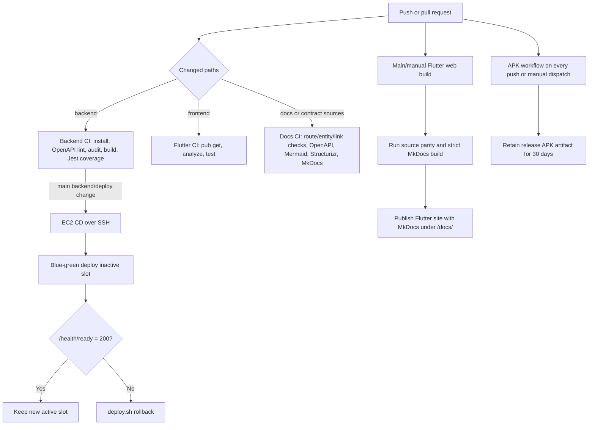

# CI/CD workflow

## Existing application gates

| Workflow | Trigger | Gates/output |
| --- | --- | --- |
| Backend CI | Backend push/PR | Reject tracked uploads, OpenAPI lint, high-severity npm audit, TypeScript build, Jest coverage |
| Backend CD | Main backend/deploy changes or manual | Repeats build/tests, SSH deploy, readiness check, automatic rollback attempt |
| Frontend CI | Frontend push/PR/manual | Flutter 3.44.8 dependency restore, analyze, tests |
| Build APK | Every push/manual | Firebase config from secret, release APK with hosted API defines, artifact upload |
| Web/Docs Pages | Main/manual | Flutter web build plus validated MkDocs build, one combined Pages artifact |
| Documentation CI | Docs and source-of-truth changes | Contract parity, links, OpenAPI, Mermaid, Structurizr, strict MkDocs build |

## Release limitations

- Backend CD runs `git reset --hard origin/main` on the remote deployment checkout by design; it assumes `/opt/vitalink` is a dedicated deploy clone.
- The deploy preflight validates the JWT secret but readiness is responsible for the broader required-environment inventory.
- Migrations are not automatically executed by backend CD. Operators must follow the migration order in the deployment runbook.
- No source-backed approval gate, canary traffic policy, database backup gate, artifact signing/attestation, or post-deploy authenticated clinical smoke suite is present.
