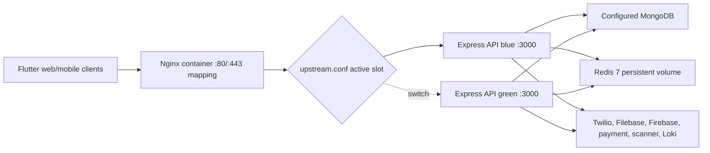

# Deployment architecture

## Checked-in EC2/Docker design

Docker Compose defines `redis`, `app-blue`, `app-green`, and `nginx` on one bridge network. The deploy script builds the inactive application slot, waits for `/health/ready`, rewrites `upstream.conf`, validates and reloads Nginx, then stops the former active slot. Rollback performs the inverse switch after health validation.

## Health model

| Probe | Meaning | Used by |
| --- | --- | --- |
| `/` | HTTP process/API index only | Backend Dockerfile healthcheck |
| `/health/live` | Express process is live | Manual/environment guidance |
| `/health/ready` | MongoDB, Firebase state, worker state, and required configuration are ready | Compose, deployment verification, runbooks |
| `/nginx-health` | Nginx process responds | Edge/load-balancer candidate |

## Transport status

The active Nginx server block listens on port 80. The HTTP-to-HTTPS redirect and TLS server block are commented templates. Docker publishes 443 and mounts a certificate directory, but those facts do not enable TLS by themselves. Production TLS termination must therefore be confirmed at Nginx or an upstream load balancer before treating the EC2 design as secure.

## Other tracked delivery paths

- `backend-cd.yml` deploys the backend to an EC2 host through SSH.
- `deploy_web.yml` publishes Flutter web to GitHub Pages.
- `frontend/vercel.json` supports Vercel static hosting and proxies `/api/*` to the Render hostname.
- Flutter mobile source and APK CI default to or explicitly build against the same Render hostname.

No checked-in record establishes which combination is currently production. See [Inconsistencies](../reference/inconsistencies.md).

## External configuration boundary

MongoDB, object storage, Twilio, Firebase credentials, payment provider, scanner, Loki, secrets, CORS origins, and client API origin are supplied outside source. Deployment diagrams show these as dependencies, not as verified provider accounts or regions.
