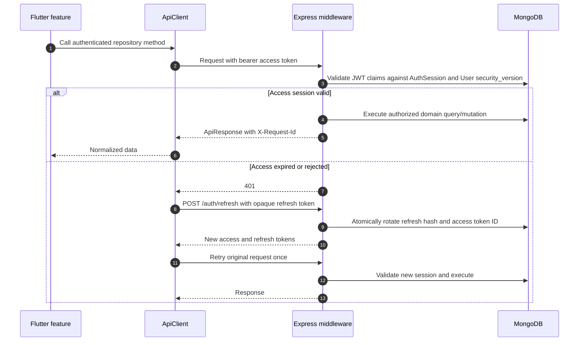
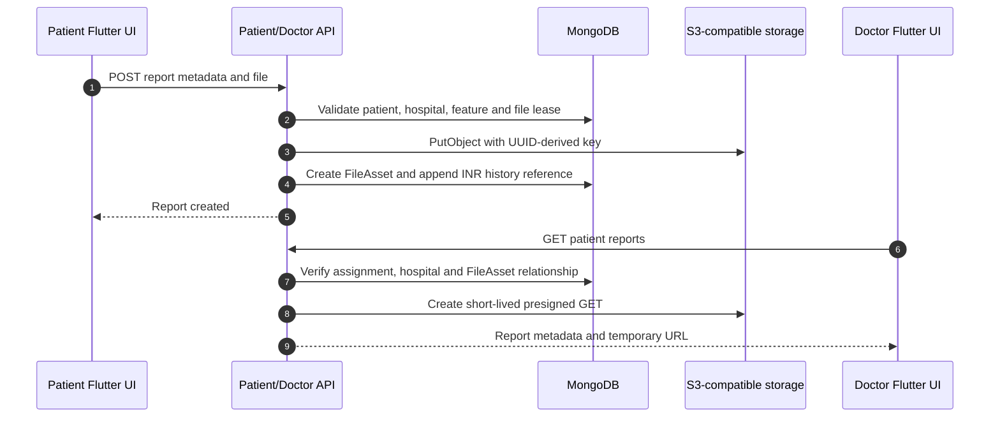
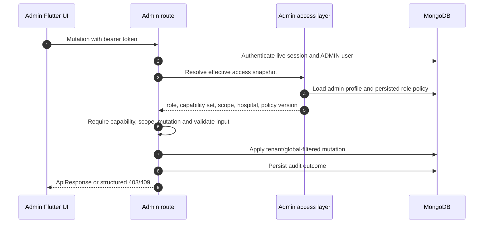
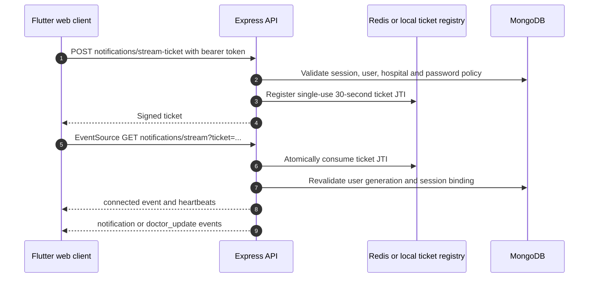
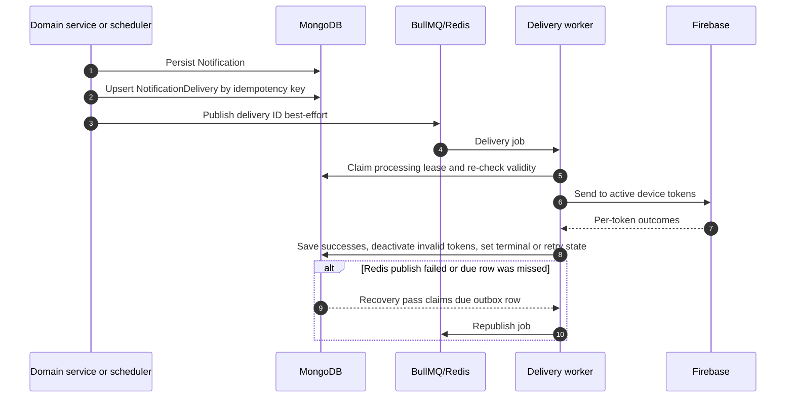

# Frontend–backend–database sequence diagrams

## Normal authenticated request with refresh

## Patient report write and doctor read

## Administrator mutation

## SSE connection from Flutter web

## Durable push delivery

