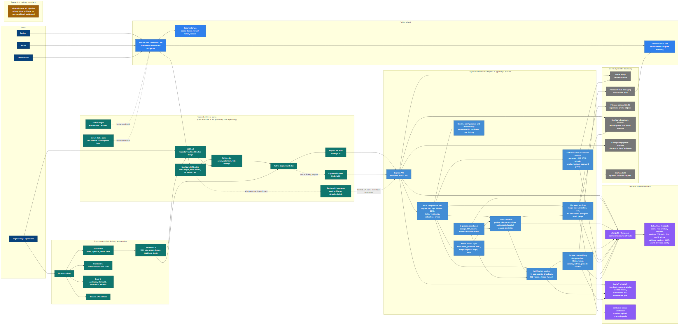
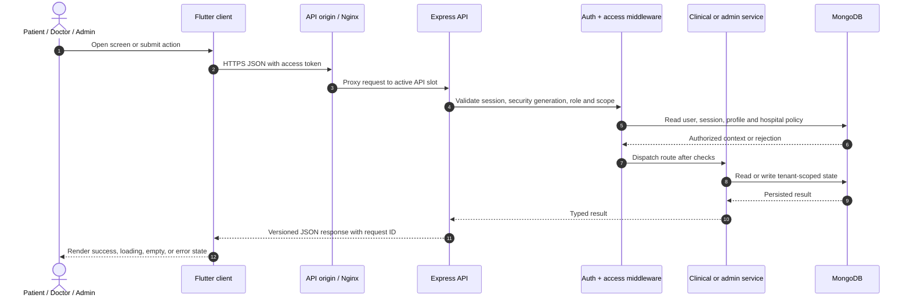
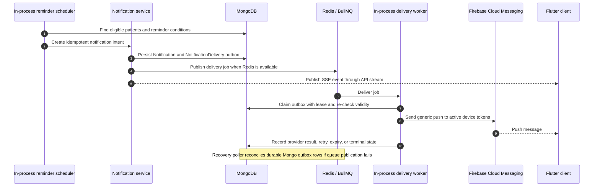
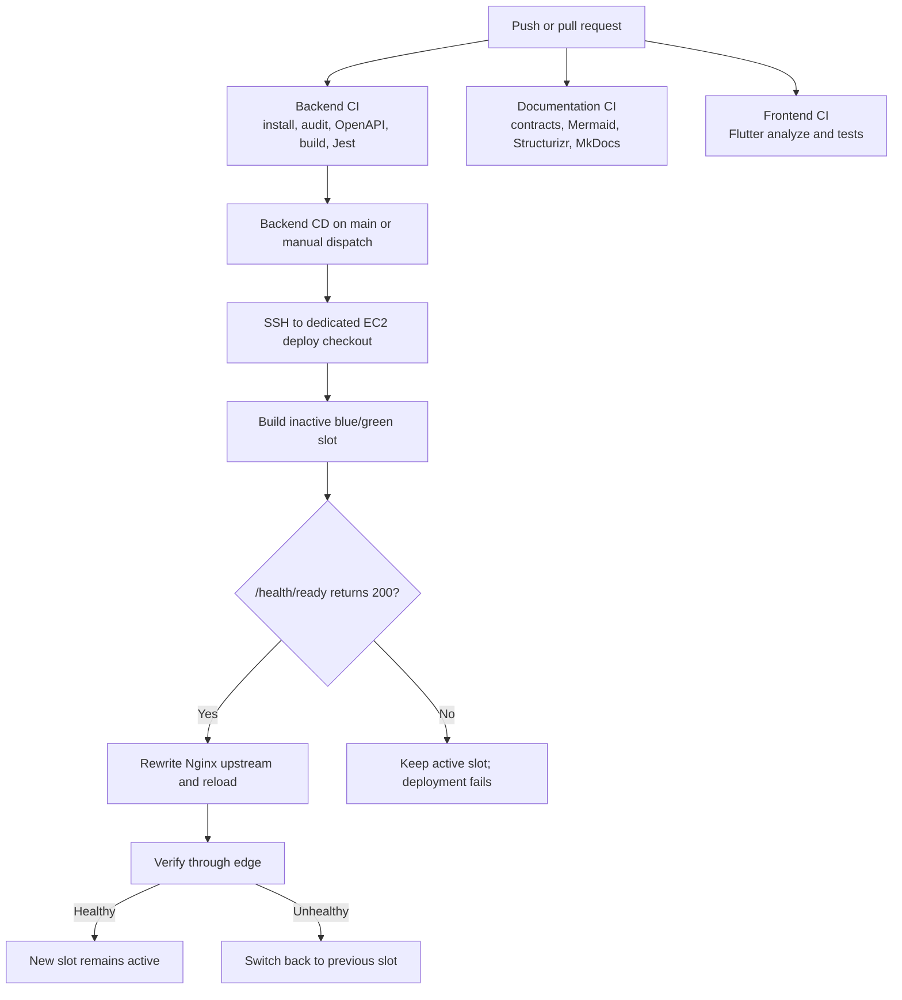

# VitaLink system design

This is the complete source-backed explanation view of VitaLink. It shows the user-facing clients, the logical backend modules, persistence, asynchronous work, external providers, deployment paths, and the ML boundary.

The important architectural fact is that VitaLink is a modular monolith: the backend modules below are separated by code boundaries, but the HTTP API, schedulers, notification worker, and recovery poller run in the same Node.js deployable process. Redis/BullMQ distributes notification work; it is not a second application service.

## Complete system view

```mermaid
flowchart LR
    subgraph Actors["Users"]
        Patient["Patient"]
        Doctor["Doctor"]
        Admin["Administrator"]
        Operator["Engineering / Operations"]
    end

    subgraph Clients["Flutter client"]
        Flutter["Flutter web / Android / iOS<br/>role-aware screens and navigation"]
        SecureStore["Secure storage<br/>access token, refresh token, session"]
        PushClient["Firebase client SDK<br/>device token and push handling"]
    end

    subgraph Delivery["Tracked delivery paths<br/>(live selection is not proven by this repository)"]
        APIOrigin["Configured API origin<br/>same-origin, build define, or hosted URL"]
        Pages["GitHub Pages<br/>Flutter web + MkDocs"]
        Vercel["Vercel static path<br/>/api rewrite to configured host"]
        EC2["EC2 host<br/>repository-defined Docker design"]
        Nginx["Nginx edge<br/>proxy, rate limit, SSE settings"]
        Active["Active deployment slot"]
        Blue["Express API blue<br/>Node.js 20"]
        Green["Express API green<br/>Node.js 20"]
        Render["Render API hostname<br/>used by Flutter defaults/builds"]
    end

    subgraph Runtime["Logical backend: one Express / TypeScript process"]
        API["Express API<br/>versioned REST + SSE"]
        HTTP["HTTP composition root<br/>request IDs, logs, Helmet, CORS,<br/>limits, versioning, validation, errors"]
        Auth["Authentication and session services<br/>password, OTP, TOTP, refresh,<br/>revoke, lockout, password policy"]
        Access["Admin access layer<br/>fixed roles, persisted RBAC,<br/>hospital/global scope, audit"]
        Clinical["Clinical services<br/>patient/doctor workflows,<br/>assignment, hospital access, statistics"]
        Files["File asset services<br/>magic-byte validation, scan,<br/>S3 operations, presigned reads, purge"]
        Notify["Notification services<br/>in-app records, broadcast,<br/>SSE tickets, stream fan-out"]
        DeliverySvc["Durable push delivery<br/>Mongo outbox, idempotency,<br/>validity, retries, provider handoff"]
        Schedulers["In-process schedulers<br/>dosage, INR, review, missed-dose reminders"]
        Config["Runtime configuration and feature flags<br/>system config, readiness, rate limiting"]

        API --> HTTP
        HTTP --> Auth
        HTTP --> Access
        HTTP --> Clinical
        HTTP --> Files
        HTTP --> Notify
        HTTP --> Config
        Access --> Clinical
        Clinical --> Files
        Clinical --> Notify
        Notify --> DeliverySvc
        Schedulers --> Notify
        Schedulers --> Clinical
    end

    subgraph State["Durable and shared state"]
        Mongo["MongoDB / Mongoose<br/>operational source of truth"]
        MongoModels["Collections / models<br/>users, role profiles, hospitals,<br/>sessions, OTP/MFA, files, notifications,<br/>delivery, devices, RBAC, audit, invoices, config"]
        Redis["Redis 7 + BullMQ<br/>rate-limit counters, single-use SSE tickets,<br/>pub/sub fan-out, notification jobs"]
        UploadVolume["Container upload workspace<br/>transient upload processing only"]
    end

    subgraph Providers["External provider boundary"]
        Twilio["Twilio Verify<br/>SMS verification"]
        FCM["Firebase Cloud Messaging<br/>mobile/web push"]
        Filebase["Filebase-compatible S3<br/>report and profile objects"]
        Scanner["Configured malware scanner<br/>HTTPS upload scan when enabled"]
        Payment["Configured payment provider<br/>checkout + HMAC webhook"]
        Loki["Grafana Loki<br/>optional sanitized log sink"]
    end

    subgraph DeliveryAutomation["Source-controlled delivery automation"]
        GitHub["GitHub Actions"]
        BackendCI["Backend CI<br/>audit, OpenAPI, build, tests"]
        FrontendCI["Frontend CI<br/>Flutter analyze and tests"]
        DocsCI["Docs CI<br/>contracts, Mermaid, Structurizr, MkDocs"]
        CD["Backend CD<br/>SSH, blue-green deploy, readiness check"]
        APK["Release APK artifact"]
    end

    subgraph Research["Research / training boundary"]
        ML["ml-service and ml_pipeline<br/>training/data artifacts; no runtime API call evidenced"]
    end

    Patient --> Flutter
    Doctor --> Flutter
    Admin --> Flutter
    Operator --> GitHub
    Operator --> EC2
    Flutter --> SecureStore
    Flutter --> PushClient
    Flutter --> APIOrigin
    Pages -. "hosts web build" .-> Flutter
    Vercel -. "hosts web build" .-> Flutter
    APIOrigin --> Nginx
    APIOrigin -. "alternate configured route" .-> Render
    EC2 --> Nginx
    Nginx --> Active
    Active --> Blue
    Active -. "switch during deploy" .-> Green
    Blue --> API
    Green --> API
    Render -. "hosted API path; live state unverified" .-> API

    API --> Mongo
    API --> Redis
    API --> Twilio
    API --> Payment
    API --> Scanner
    API --> Loki
    Auth --> Twilio
    Files --> Filebase
    Files --> Scanner
    Notify --> Redis
    DeliverySvc --> Redis
    DeliverySvc --> FCM
    Schedulers --> Mongo
    Clinical --> Mongo
    Access --> Mongo
    Auth --> Mongo
    Files --> Mongo
    Notify --> Mongo
    DeliverySvc --> Mongo
    Mongo --> MongoModels
    Files --> UploadVolume
    FCM --> PushClient

    GitHub --> BackendCI
    GitHub --> FrontendCI
    GitHub --> DocsCI
    BackendCI --> CD
    CD --> EC2
    CD --> Active
    GitHub --> APK

    classDef actor fill:#08427b,color:#fff,stroke:#062d55
    classDef client fill:#2f80ed,color:#fff,stroke:#1c5daa
    classDef runtime fill:#438dd5,color:#fff,stroke:#1f5d96
    classDef data fill:#8b5cf6,color:#fff,stroke:#5b21b6
    classDef external fill:#777,color:#fff,stroke:#444
    classDef delivery fill:#0f766e,color:#fff,stroke:#064e49
    classDef research fill:#a16207,color:#fff,stroke:#713f12
    class Patient,Doctor,Admin,Operator actor
    class Flutter,SecureStore,PushClient client
    class APIOrigin,Pages,Vercel,EC2,Nginx,Active,Blue,Green,Render,GitHub,BackendCI,FrontendCI,DocsCI,CD,APK delivery
    class API,HTTP,Auth,Access,Clinical,Files,Notify,DeliverySvc,Schedulers,Config runtime
    class Mongo,MongoModels,Redis,UploadVolume data
    class Twilio,FCM,Filebase,Scanner,Payment,Loki external
    class ML research
```

## What each area means

| Area | What to explain | Source evidence |
| --- | --- | --- |
| Flutter client | One role-aware client serves patients, doctors, and administrators. It stores session material securely, calls the versioned API, opens SSE notification streams, and registers device tokens for push. | `frontend/lib/app/routers.dart`; `frontend/lib/core/network/api_client.dart`; `frontend/lib/services/realtime/notification_stream_client.dart` |
| API boundary | Express adds request IDs, sanitized request logging, Helmet, CORS, timeouts, JSON limits, rate limits, API version headers, feature flags, validation, and one error boundary before dispatching routes. | `backend/src/app.ts` |
| Authentication and authorization | Password, phone OTP, admin TOTP, refresh-token rotation, revocation, lockout, password policy, hospital access, persisted RBAC, and audit checks protect the route families. | `backend/src/routes/auth.routes.ts`; `backend/src/services/auth-session.service.ts`; `backend/src/services/admin-access.service.ts` |
| Clinical core | Patient and doctor controllers operate on profiles, INR reports, dosage plans, health data, assignments, care updates, and statistics with hospital/tenant checks. | `backend/src/controllers/patient.controller.ts`; `backend/src/controllers/doctor.controller.ts`; `backend/src/services/hospital-access.service.ts` |
| Files | Uploads are validated, malware-scanned when enabled, tracked in `FileAsset`, stored in S3-compatible object storage, read through authorized URLs, and purged through a compensating workflow. | `backend/src/utils/fileUpload.ts`; `backend/src/services/fileasset.service.ts` |
| Notifications | In-app notifications are durable in MongoDB. SSE is served by the API; Redis pub/sub lets multiple API processes fan out events. Push delivery uses a durable Mongo outbox with optional BullMQ acceleration and recovery polling. | `backend/src/services/realtime-notification.service.ts`; `backend/src/services/notification-delivery.service.ts`; `backend/src/jobs/notification-delivery.worker.ts` |
| Clinical automation | Reminder schedulers run inside the API process and create idempotent dosage, INR, review, and missed-dose notifications. They are not separate deployable services. | `backend/src/server.ts`; `backend/src/jobs/dosage.scheduler.ts`; `backend/src/jobs/clinical-reminder.scheduler.ts` |
| Deployment | The checked-in deployment design is Nginx plus blue/green Node containers and Redis on EC2, with MongoDB and providers configured externally. Flutter web, Vercel, Render, and GitHub Pages are also present in source; the live combination is unconfirmed. | `deploy/docker-compose.yml`; [deployment architecture](deployment.md); [source inconsistencies](../reference/inconsistencies.md) |
| ML boundary | `ml-service` and `ml_pipeline` are shown for completeness, but no application route or backend call currently proves runtime clinical integration. Treat them as research/training assets until a reviewed serving contract exists. | `ml-service/main.py`; [source inconsistencies](../reference/inconsistencies.md) |

## Three flows to use while explaining the diagram

### 1. Authenticated clinical request

### 2. Clinical reminder to realtime and push delivery

### 3. Backend release and rollback

## Boundary and accuracy notes

- MongoDB is the durable source of truth. Redis is shared coordination and recoverable work distribution; notification recovery is designed to continue from MongoDB if Redis is unavailable.
- FCM is optional at runtime. When enabled, the backend initializes Firebase Admin and the client receives push through the Firebase SDK.
- The payment provider is configurable. Checkout creation is an outbound HTTPS call; settlement returns through an HMAC-verified `/api/v1/webhooks/payment` route.
- The malware scanner is an external HTTPS boundary and is required by production/staging readiness configuration. Local development may disable it.
- Loki is optional logging infrastructure, not a request dependency.
- The repository contains several deployment paths. This diagram intentionally labels them as tracked alternatives instead of claiming which one is live.

For deeper views, use the [C4 model](c4.md), [backend component view](components.md), [deployment architecture](deployment.md), [CI/CD workflow](ci-cd.md), and [logical database ER model](../data/er-diagram.md).
