# Database ER diagram

MongoDB is document-oriented, but the implementation uses explicit ObjectId references that can be represented as a logical ER model. Embedded patient dosage, INR, medical-history, health-log, assignment-conflict, and purge structures are documented in the entity catalog and are not separate collections.

```mermaid
erDiagram
    USER ||--o| ADMIN_PROFILE : "profile_id"
    USER ||--o| DOCTOR_PROFILE : "profile_id"
    USER ||--o| PATIENT_PROFILE : "profile_id"
    HOSPITAL ||--o{ ADMIN_PROFILE : "hospital_id"
    HOSPITAL ||--o{ DOCTOR_PROFILE : "hospital_id"
    HOSPITAL ||--o{ PATIENT_PROFILE : "hospital_id"
    HOSPITAL ||--o{ INVOICE : "hospital_id"
    USER ||--o{ AUTH_SESSION : "user_id"
    USER ||--o{ OTP_CHALLENGE : "user_id"
    USER ||--o{ ADMIN_MFA_CHALLENGE : "user_id"
    USER ||--o{ DEVICE_TOKEN : "user_id"
    USER ||--o{ NOTIFICATION : "user_id"
    NOTIFICATION ||--o| NOTIFICATION_DELIVERY : "notification_id"
    USER ||--o{ NOTIFICATION_DELIVERY : "user_id"
    USER ||--o{ AUDIT_LOG : "user_id"
    USER ||--o{ FILE_ASSET : "owner_user_id and created_by"
    HOSPITAL ||--o{ FILE_ASSET : "hospital_id"
    PATIENT_PROFILE ||--o{ FILE_ASSET : "patient_profile_id"
    USER ||--o{ PATIENT_PROFILE : "assigned_doctor_id"
    USER ||--o{ ADMIN_ROLE_POLICY : "updated_by"
    USER ||--o{ ADMIN_ROLE_POLICY_REVISION : "actor_user_id"
    ADMIN_ROLE_POLICY ||--o{ ADMIN_ROLE_POLICY_REVISION : "role_key versions"
    ADMIN_ROLE_POLICY_REVISION o|--o{ ADMIN_ROLE_POLICY_REVISION : "restored_from_revision_id"

    USER {
        ObjectId _id PK
        string login_id UK
        string user_type
        ObjectId profile_id UK
        number security_version
        boolean is_active
    }
    PATIENT_PROFILE {
        ObjectId _id PK
        ObjectId hospital_id FK
        ObjectId assigned_doctor_id FK
        string account_status
        object demographics
        object medical_config
    }
    DOCTOR_PROFILE {
        ObjectId _id PK
        ObjectId hospital_id FK
        string name
        string contact_number
    }
    ADMIN_PROFILE {
        ObjectId _id PK
        ObjectId hospital_id FK
        string admin_role
        string permission
    }
    HOSPITAL {
        ObjectId _id PK
        string code UK
        string status
        number lifecycle_generation
    }
    AUTH_SESSION {
        ObjectId _id PK
        ObjectId user_id FK
        string access_token_id UK
        string refresh_token_hash UK
        date expires_at
    }
    FILE_ASSET {
        ObjectId _id PK
        ObjectId hospital_id FK
        ObjectId owner_user_id FK
        ObjectId patient_profile_id FK
        string object_key UK
        string status
    }
    NOTIFICATION {
        ObjectId _id PK
        ObjectId user_id FK
        string reminder_key UK
        string type
        date delivery_valid_until
    }
    NOTIFICATION_DELIVERY {
        ObjectId _id PK
        ObjectId notification_id FK
        ObjectId user_id FK
        string idempotency_key UK
        string status
        date expires_at
    }
    INVOICE {
        ObjectId _id PK
        ObjectId hospital_id FK
        string invoice_number UK
        string billing_period
        string status
    }
    ADMIN_ROLE_POLICY {
        ObjectId _id PK
        string role_key UK
        number policy_version
        object capabilities
    }
    ADMIN_ROLE_POLICY_REVISION {
        ObjectId _id PK
        string role_key
        number new_policy_version
        ObjectId actor_user_id FK
    }
    OTP_CHALLENGE {
        ObjectId _id PK
        ObjectId user_id FK
        string status
        date purge_at
    }
    ADMIN_MFA_CHALLENGE {
        ObjectId _id PK
        ObjectId user_id FK
        string status
        date purge_at
    }
    DEVICE_TOKEN {
        ObjectId _id PK
        ObjectId user_id FK
        string fcm_token UK
        boolean is_active
    }
    AUDIT_LOG {
        ObjectId _id PK
        ObjectId user_id FK
        string action
        boolean success
    }
```

## Modeling qualifications

- `User.profile_id` is required and points to exactly one role-specific profile through `refPath`; the three profile edges are mutually exclusive even though Mermaid cannot express the XOR constraint.
- `PatientProfile.assigned_doctor_id` points to the doctor `User._id`, not `DoctorProfile._id`.
- `AdminRolePolicyRevision` is append-only and related to a policy by `role_key` plus monotonic version rather than a direct policy ObjectId.
- `system_counters` is a native MongoDB collection used for atomic hospital-code allocation and has no Mongoose model.
