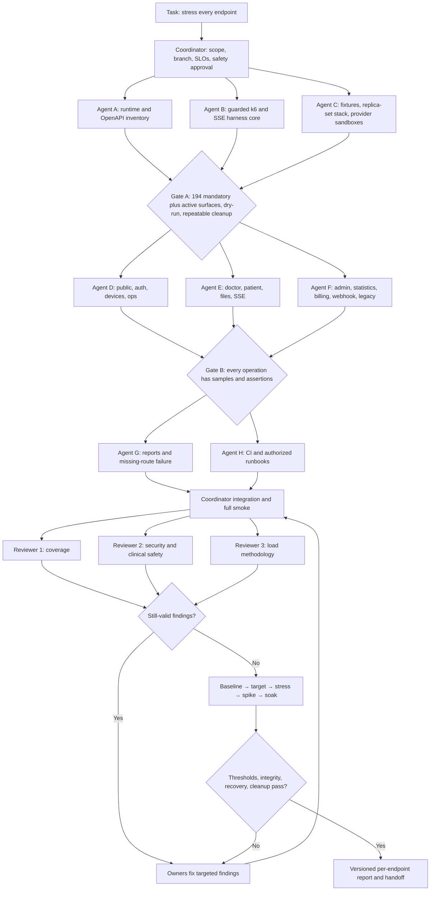

# VitaLink Full-System Stress-Test Implementation Plan

Status: implementation plan only  
Repository snapshot: `main` at `6f254df94b52568fcd3d39875dc2257afd0be283` on 2026-07-22  
Primary target: the Express/TypeScript API in `backend`  
Inactive surfaces: `ml-service` is currently a training/placeholder project and exposes no HTTP endpoint; the Flutter client consumes the API but exposes no server endpoint.

## 1. Outcome and non-negotiable definition of done

Build a repeatable, guarded stress-testing system that:

1. discovers and tracks every runtime API operation;
2. exercises every operation with valid state and meaningful assertions;
3. measures every operation independently as well as in realistic mixed journeys;
4. stresses long-lived SSE connections, file uploads, auth, webhooks, queues, Redis, MongoDB, and object storage using protocol-appropriate runners;
5. checks clinical, tenant, session, idempotency, and cleanup invariants after load;
6. emits a versioned final report with a row for every endpoint; and
7. fails CI or the task if a route is untested, a result is missing, cleanup is incomplete, or a safety/integrity gate fails.

No workflow can honestly guarantee mathematically “bug-free” code. For this task, release-ready means: no known blocker/high-severity defect; 100% inventory coverage; all automated checks passing; deterministic seed and cleanup; independent review completed; and all remaining lower-severity risks explicitly accepted in the report.

## 2. Current endpoint surface

Runtime route registration is the source of truth. OpenAPI is a contract to reconcile against it, not the sole inventory source.

| Runtime surface | GET | POST | PUT | PATCH | DELETE | Total |
|---|---:|---:|---:|---:|---:|---:|
| Canonical `/api/v1` | 40 | 30 | 13 | 8 | 4 | 95 |
| Deprecated `/api` alias | 40 | 30 | 13 | 8 | 4 | 95 |
| Global `/`, liveness, readiness | 3 | 0 | 0 | 0 | 0 | 3 |
| Application operations | 83 | 60 | 26 | 16 | 8 | **193** |
| Nginx `GET /nginx-health` | 1 | 0 | 0 | 0 | 0 | 1 |
| Mandatory explicit whole-system operations | 84 | 60 | 26 | 16 | 8 | **194** |

The 95 canonical operations consist of the version index plus 94 router operations:

| Family | Canonical operations | Special concerns |
|---|---:|---|
| API index | 1 | version headers and legacy deprecation headers |
| Auth | 12 | two rate limiters on login, OTP/TOTP, refresh rotation, revocation |
| Devices | 2 | token ownership transfer and deregistration |
| Doctor | 20 | tenant/assignment rules, clinical mutations, uploads, SSE |
| Patient | 19 | own-record isolation, dosage/report mutations, uploads, SSE |
| Admin | 35 | permission matrix, audit writes, destructive and batch operations |
| Statistics | 5 | expensive aggregation and tenant-scoped/global variants |
| Payment webhook | 1 | HMAC, timestamp freshness, idempotency, provider state |

The current `backend/docs/api/openapi.yaml` has 80 paths and 95 operations and matches the canonical runtime surface. It currently has no stable `operationId` values. Wave A must add unique operation IDs (or initially derive stable manifest IDs from method plus normalized path), then preserve route/OpenAPI/manifest equality with an automated comparison.

The fixed mandatory denominator is 194. The effective run denominator is generated per environment as `194 + enabled conditional routes + applicable protocol-derived checks`; a report may not claim complete coverage using only 194 when additional surfaces are active.

Conditional and protocol-derived routes are tracked separately and must still receive report rows:

- With API docs enabled, resolve the effective `API_DOCS_PATH` (default `/docs`), test `GET/HEAD <API_DOCS_PATH>`, `GET/HEAD <API_DOCS_PATH>/openapi.yaml`, Basic authentication, and Swagger static asset reachability. When disabled, record the surface as not applicable with configuration evidence. Do not treat every third-party Swagger asset as a VitaLink business operation.
- Test Nginx `GET /nginx-health` separately from application liveness/readiness; an edge-success response does not prove the application or dependencies are healthy.
- Express/CORS-derived `HEAD` and `OPTIONS` behavior receives a small conformance suite for every GET route or route family. These are not counted as explicitly implemented operations.
- The `/api/*` not-found fallback receives a low-rate semantic test and is not a finite business endpoint.

## 3. Chosen implementation architecture

Use two coordinated load generators:

- **Pinned Grafana k6 container/binary** for normal HTTP, JSON, multipart uploads, auth journeys, rate profiles, checks, tagged per-endpoint metrics, thresholds, JSON output, and custom end-of-test summaries.
- **A small pinned Node.js SSE runner** for long-lived patient and doctor EventSource connections. Core k6 lists HTTP, HTTP/2, WebSocket, and gRPC support but not a first-class callback-based SSE client. The SSE runner must measure connection success, time to headers, time to first event, heartbeat gaps, notification delivery latency, unexpected disconnects, reconnect success, and open-connection cleanup. Its JSON output is merged into the same report.

Do not add the load framework to the production runtime dependencies. Keep it under a dedicated directory with pinned development/container versions.

Proposed tree:

```text
backend/load-tests/
  README.md
  config/
    environments.example.json
    profiles.js
    thresholds.js
  inventory/
    extract-runtime-routes.ts
    reconcile-openapi.ts
    coverage.test.ts
  generated/
    endpoints.json
  fixtures/
    seed.ts
    cleanup.ts
    reconcile.ts
    synthetic-files/
  lib/
    auth.js
    client.js
    checks.js
    data-pool.js
    guards.js
    metrics.js
    signing.js
  scenarios/
    public-auth-devices/
    doctor/
    patient/
    admin/
    statistics/
    webhook/
    uploads/
    legacy/
  sse/
    runner.ts
    metrics.ts
  profiles/
    contract-smoke.js
    endpoint-baseline.js
    realistic-load.js
    stress.js
    spike.js
    soak.js
    rate-limit.js
    degraded-dependencies.js
  reporting/
    merge-results.ts
    render-report.ts
    report-schema.json
  reports/
    .gitkeep
```

Also add:

- `backend/load-tests/package.json` for inventory, fixture, SSE, and reporting tools only;
- `deploy/load-test/docker-compose.yml` for an isolated production-like test stack;
- `.github/workflows/backend-load-test.yml` for lint/coverage/smoke and manually authorized larger runs;
- a short pointer from `backend/README.md` or the existing backend documentation index.

## 4. Machine-enforced endpoint inventory

Create `generated/endpoints.json` from three independent views:

1. perform an AST/source inventory of Express app/router registrations, including chained `router.route(...).get(...).put(...)`, router prefixes, canonical and legacy mounts, and global routes;
2. parse OpenAPI and normalize `{id}` versus Express `:id` parameters;
3. reconcile against the built app and an effective-environment reachability probe, including configured docs mounts, Nginx health, and applicable HEAD/OPTIONS behavior. If Express internals make router introspection unstable, use an explicit route registry exported by the application and prove it with runtime probes rather than relying on regex/source parsing alone.

Each manifest row must contain:

- stable endpoint ID and OpenAPI `operationId`;
- HTTP method, canonical path, legacy alias, and source file;
- auth mode, role, admin permission, and tenant rules;
- content type, request schema, expected success statuses, and meaningful error statuses;
- prerequisites and produced resource IDs;
- read/write/destructive classification;
- idempotency and concurrency expectations;
- external dependencies used;
- scenario module, cleanup procedure, minimum sample count, metric tags, and threshold class.

Coverage gates:

- canonical runtime set equals OpenAPI set;
- every canonical route has exactly one primary scenario owner;
- every legacy alias has a reachability/parity test;
- all 194 mandatory explicit operations and every enabled conditional/applicable protocol surface appear in the final report;
- a newly added route fails the coverage test until it has fixtures, assertions, thresholds, and reporting ownership;
- duplicate or unbounded dynamic URL tags are rejected; metrics use normalized endpoint IDs to avoid cardinality explosions.

## 5. Safe, production-like environment

Never run mutation, auth-abuse, capacity, stress, spike, or soak tests against production or real patient data.

Provision a disposable staging stack with two named modes:

- **Topology-parity mode:** blue and green containers exist, but Nginx sends traffic only to the active slot, matching the current blue/green configuration. This is the authoritative current-capacity topology.
- **Distributed-correctness mode:** two active API replicas are deliberately load-balanced to test shared Redis rate limits, SSE tickets/pub-sub, graceful replacement, and scale-out behavior. Report it as a different topology, never as current production capacity.
- a MongoDB replica set, not standalone MongoDB, because VitaLink clinical/admin flows use transactions;
- Redis for shared rate limits, single-use SSE tickets, pub/sub, BullMQ, and delivery workers;
- isolated S3-compatible storage or a dedicated test bucket/prefix;
- sandbox/stub implementations for Twilio Verify, Firebase/FCM, malware scanning, and the payment provider;
- Loki or another log sink plus host/container, MongoDB, Redis, Nginx, and queue metrics;
- synthetic data only, with no copied PHI.

Both application slots currently import the dosage scheduler. Run ordinary capacity profiles outside the scheduled window and explicitly observe scheduler behavior. If distributed-correctness testing requires disabling duplicate schedulers, add a narrowly scoped, fail-safe environment control or leader-election design and test it independently; do not silently remove background work from reported capacity.

The current S3/Filebase endpoint and Twilio Verify base URL are not fully replaceable through configuration. Before using local provider sandboxes, add narrowly scoped dependency configuration/injection with production-safe defaults and startup validation. Never add an HTTP OTP bypass or a code path that accepts unsigned payment callbacks.

Mandatory runtime guards in the load harness:

- `ALLOW_LOAD_TESTS=true` must be present;
- the base URL must match an explicit allowlist and must not match known production hosts;
- environment fingerprint endpoint/file and test-run ID must match the seeded database;
- maximum virtual users, arrival rate, duration, upload bytes, and SSE connections are capped by the selected profile;
- destructive profiles require an additional `ALLOW_DESTRUCTIVE_LOAD=true` flag;
- credentials and bearer/refresh/SSE tickets are never printed or written to reports;
- normal abort handlers invoke cleanup and write a partial report, but they are not the safety boundary;
- any tenant leak, authorization bypass, duplicate clinical mutation, corrupt state, runaway queue, or failed cleanup immediately stops the run.

Persist a cleanup journal/run ledger outside the load-generator process before creating each resource. A separately runnable, out-of-process finalizer/reaper must clean and reconcile by run ID after Ctrl-C, CI cancellation, container/host loss, timeout, or threshold abort. Every interrupted run remains **incomplete** until the finalizer proves zero residue; never claim that in-process teardown is guaranteed after process loss.

The current edge/application protection settings would otherwise dominate a single-generator test: Nginx is configured around 30 requests/second per IP with burst 50; the application limit comes from `SystemConfig` (currently defaulting to 100 requests per 15 minutes per IP); login has an additional default 20 requests per 15 minutes per IP. Run a protections-on profile that verifies these limits, then a separately authorized capacity profile with temporary, recorded staging-only limits and/or distributed source IPs. Never disable the protection logic in product code.

Before implementation, decide whether the target is the local Compose stack, a dedicated EC2 staging stack, or both. Performance numbers are meaningful only when the report records CPU/memory limits, replica count, database tier, region, network path, Nginx config, environment variables affecting limits, and dependency modes.

## 6. Deterministic fixtures and data ownership

The fixture generator must create at least:

- two active hospitals plus suspended/inactive edge-case hospitals;
- one App Admin, one global Auditor, hospital admins/auditors with distinct permission sets, and tenantless invalid-role fixtures;
- multiple doctors and patients per hospital with active, discharged, deceased, assignment-conflict, and superseded/quarantined states where supported;
- dosage history, INR reports, health logs, notifications, doctor-update events, device tokens, audit logs, invoices, checkout reservations, and outbox/delivery records;
- valid small and maximum-size PDF/JPEG/PNG/WebP samples plus invalid MIME/signature samples;
- isolated credentials and resource pools per virtual user or iteration.

Rules:

- use a run prefix such as `load_<runId>_...` on every created record;
- never share a mutable patient, invoice, session, notification, or hospital across concurrent virtual users unless the scenario specifically tests contention;
- login/OTP/TOTP setup happens in a controlled setup stage; the general capacity suite uses pre-authenticated session pools;
- refresh tokens are single-owner and never reused concurrently except in an explicit replay/race scenario;
- creation scenarios capture IDs for downstream reads/updates/deletes, but baseline tests must not depend on an earlier scenario having completed successfully;
- cleanup is idempotent and scoped strictly to the run ID;
- post-cleanup verification must prove zero remaining database records, objects, device tokens, streams, queue jobs, and test credentials for the run.

## 7. Assertions: performance is not enough

Every endpoint scenario must include:

1. expected status and content type;
2. response envelope/schema and essential field checks;
3. tenant, owner, role, and permission assertions;
4. database or API-visible postcondition for writes;
5. idempotency/replay behavior where applicable;
6. correlation via `X-Request-Id` and the test run ID;
7. cleanup registration; and
8. normalized tags: endpoint ID, method, route family, scenario, role, tenant mode, response class, and dependency mode.

Expected rejections such as 400, 401, 403, 404, 409, 423, or 429 are successful test outcomes only when the scenario explicitly declares that response and verifies its body/side effects. They must not be mixed into the capacity error rate.

## 8. Test profiles and execution order

Run profiles in order. A later profile is blocked if an earlier gate fails.

### G0 — preflight

- build backend and load-test tooling;
- validate OpenAPI, the 194 mandatory explicit operations, and the environment-specific conditional/protocol inventory;
- verify target allowlist and staging fingerprint;
- seed twice and clean twice to prove repeatability;
- verify liveness/readiness and dependency telemetry;
- record Git SHA, image digests, config hash, and data seed.

### G1 — contract smoke: every operation

- one virtual user, one controlled attempt for every canonical operation;
- one attempt for every legacy alias and all three global operations;
- docs and HEAD/OPTIONS conformance when enabled;
- happy-path semantic checks plus one representative auth/tenant rejection per protected route family;
- required result: 194/194 mandatory explicit operations plus every enabled conditional/applicable protocol surface attempted and reported; all postconditions and out-of-process cleanup reconciliation pass.

### G2 — isolated endpoint baseline

- run each endpoint alone at low concurrency;
- reads: enough successful samples for stable percentiles, initially 100–500 per endpoint;
- bounded writes/destructive operations: initially 20–100 disposable resources per endpoint;
- uploads: small, typical, and maximum permitted size at controlled concurrency;
- SSE: connection/open/heartbeat/event/reconnect baseline rather than request latency;
- output establishes the no-contention service time and identifies intrinsically slow handlers.

### G3 — realistic weighted journeys

Use separate scenario pools rather than one random script:

- patient journey: profile, reports, dosage calendar, dosage/health log, notifications, doctor updates;
- doctor journey: patient list/detail, report review/update, dosage/instructions/config, notifications;
- admin journey: lists, statistics, audit, scoped updates, low-rate creation/management;
- auth journey: login challenge/verification, refresh, me, logout/revoke at a realistic rate;
- SSE pool: sustained doctor/patient streams with generated events;
- background platform work: notification delivery and scheduled/queue activity.

Initial weights are hypotheses. Replace them with sanitized production access-log proportions before a capacity sign-off. Legacy traffic is weighted from observed usage; do not blindly double canonical load.

### G4 — target load

- ramp to the agreed expected peak and hold for 30–60 minutes;
- keep arrival rate independent from server response time where capacity measurement matters;
- verify all endpoint-class thresholds, no dropped iterations, stable resource usage, stable queue lag, and post-run recovery.

### G5 — stepped stress/capacity breakpoint

- increase load in bounded steps with hold periods;
- stop at the first declared saturation condition or safety gate;
- report the last good step, first bad step, bottleneck evidence, and recovery time;
- capacity breakpoint is a measurement, not a normal CI pass/fail threshold.

### G6 — spike and reconnect storm

- abrupt traffic spike followed by recovery;
- separate login burst, API burst, upload burst, and SSE reconnect burst;
- verify Nginx/app 429/503 behavior, no process death, no ticket reuse, and bounded recovery.

### G7 — soak

- 2–8 hours at sustainable target load;
- detect memory/connection leaks, timer/job duplication, queue growth, Redis key leakage, Mongo connection growth, object leaks, token/session drift, and percentile degradation;
- require a post-soak quiet period and return-to-baseline check.

### G8 — degraded dependencies and graceful recovery

Run separately from capacity numbers:

Implementation status: this profile is currently disabled by the harness guard.
Enable it only after the task workflow adds an automated dependency fault
coordinator, timestamps each injected/recovered state, and verifies recovery.

- Redis interruption/recovery across two API replicas;
- slow/unavailable object storage and malware scanner during uploads;
- Twilio/FCM/payment sandbox timeout/error responses;
- Mongo primary stepdown in the replica set;
- worker pause/restart and queue backlog drain;
- application SIGTERM/blue-green switch with in-flight requests and SSE reconnects.

Verify safe failures, bounded timeouts, no false success, no duplicate mutation/delivery, and correct readiness state.

## 9. Endpoint-family test requirements

### Global and versioning

Test `/`, `/api`, `/api/v1`, `/health/live`, and `/health/ready` independently. Liveness must remain cheap and process-only. Readiness must accurately reflect MongoDB, Firebase state, worker state, and missing configuration. Verify canonical version headers and legacy `Deprecation`, `Sunset`, and `Link` headers.

### Auth

Separate normal auth capacity from abuse protection. Test valid/invalid login, patient/doctor OTP verification and resend, admin TOTP verification/setup/status/activation, refresh rotation, replayed refresh rejection, revoke, logout, `me`, and password change/session invalidation. Use sandbox OTP delivery and real TOTP computation from test-only secrets. Never disable or bypass MFA to make load easier.

### Devices and notifications

Test registration, same-token ownership transfer, deregistration, unread count/list pagination, single/read-all updates, outbox enqueue, FCM stub acceptance/failure/retry, deduplication, and dead-letter behavior. Ensure notification payload assertions do not store clinical data in provider-facing bodies.

### Doctor and patient clinical operations

Test authorized same-tenant paths and explicit cross-tenant/wrong-assignment failures. For dosage, reports, instructions, review config, health logs, patient creation, and reassignment, verify transactionality and domain invariants under concurrency. Include same-record races deliberately, but keep ordinary throughput runs on per-VU records.

### Uploads

Patient report uploads allow up to 10 MB; patient and doctor profile images allow up to 5 MB. Test representative and maximum sizes, MIME/signature mismatch, scanner rejection/unavailability, object-store timeout/ambiguous PUT, compensation, presigned read behavior, and concurrent memory pressure. Record generator bandwidth separately so the client does not become the bottleneck.

### SSE

For both patient and doctor streams, test bearer/ticket connection, 30-second single-use ticket behavior, ticket replay/expiry, heartbeat gaps, three-stream-per-user and ten-stream-per-IP enforcement, concurrent connections across replicas, Redis publication, event ordering/deduplication, reconnect storms, and cleanup after client disconnect or server restart. Report connections and events, not HTTP RPS.

### Admin and statistics

Run App Admin, tenant-scoped Hospital Admin, global Auditor, and read-only/insufficient-permission cases. Measure audit middleware write cost. Test list pagination/filtering at small and large tenant sizes. Statistics need tenant and global datasets and should expose aggregation/query bottlenecks. Destructive hospital/user/doctor/patient, batch, reset, config, role, reassignment, invoice, and broadcast actions use disposable resources and bounded rates.

### Billing and webhook

Use a deterministic payment sandbox. Reserve a checkout, sign the webhook exactly as the provider would, test valid settlement, duplicate event, replayed timestamp, wrong HMAC, out-of-order event, provider timeout, and concurrent duplicate delivery. Verify exactly-once business state even if delivery is at least once.

### Legacy aliases

Every legacy route gets parity/reachability coverage and legacy headers. Apply heavy load only in proportion to real legacy traffic. Report canonical and legacy results separately so deprecation traffic cannot hide canonical regressions.

## 10. Observability and bottleneck evidence

The current repository has structured Winston logs with optional Loki, Nginx access logs, and health endpoints, but no implemented `/metrics` endpoint. Before capacity sign-off, collect at minimum:

- generator CPU, memory, network, dropped iterations, and connection use;
- Nginx connections, request rate, upstream latency/status, and rate-limit responses;
- API replica CPU, RSS/heap, event-loop delay, GC, open sockets, request count/latency/status, and restarts;
- MongoDB connections, operations, query latency, slow queries, locks/tickets, replication lag, and transaction aborts;
- Redis commands/latency, memory, connections, pub/sub, rate-limit keys, ticket keys, and evictions;
- BullMQ queued/active/completed/failed/delayed counts and oldest-job age;
- object-store requests/latency/errors/bytes;
- SSE active streams, connection attempts, rejections, disconnects, heartbeat/event latency;
- external sandbox request latency/error/retry counts.

Use staging APM/Prometheus/CloudWatch if available; otherwise add test-only metric instrumentation and collect container/Mongo/Redis statistics. A latency chart without server/dependency evidence is insufficient to diagnose capacity.

## 11. Threshold model

Product owners must approve endpoint-class SLOs before the final capacity run. Do not invent a single universal latency threshold for all operations.

Mandatory correctness thresholds for every profile:

- inventory/report coverage: 100%;
- semantic assertion failures: 0;
- tenant/authorization/privacy violations: 0;
- unexpected statuses: 0;
- data-integrity/idempotency failures: 0;
- uncleaned test artifacts: 0;
- leaked SSE connections after grace period: 0;
- generator dropped iterations at target load: 0.

Define latency/error budgets by class, for example:

- cheap operational reads;
- normal authenticated reads;
- aggregation/list reads;
- ordinary clinical writes;
- transactional/admin writes;
- uploads by size;
- external-provider-dependent operations;
- SSE connection, first-event, event-delivery, heartbeat, and reconnect metrics.

For each class record p50, p90, p95, p99, maximum, throughput, and error/status distribution. k6 thresholds must return a non-zero exit code on failure. Abort-on-fail is reserved for safety and gross saturation; ordinary SLO failures should finish the bounded stage so the report retains diagnostic evidence.

## 12. Final report contract

Every run creates immutable, timestamped artifacts:

```text
reports/<timestamp>-<gitSha>-<profile>/
  report.md
  report.html
  summary.json
  endpoints.csv
  raw-k6-summary.json
  raw-sse-summary.json
  environment.json
  manifest.json
  integrity-reconciliation.json
  logs-redacted.txt
```

The report must contain:

1. executive result: pass, fail, aborted, or incomplete;
2. fixed mandatory count, generated effective-environment denominator, and exact coverage count, including missing/zero-sample/not-applicable surfaces with evidence;
3. commit, build/image/config/manifest hashes and environment sizing;
4. workload profiles, duration, VUs/arrival rates/connections, and data volume;
5. per-endpoint table with attempts, successes, semantic-check rate, status distribution, RPS, p50/p90/p95/p99/max, bytes, threshold result, first failing request ID, and cleanup/postcondition status;
6. SSE connection/event table;
7. dependency and resource utilization timelines correlated with test stages;
8. last-good and first-bad capacity steps;
9. errors grouped by endpoint, status, exception signature, and dependency;
10. clinical/tenant/idempotency/cleanup reconciliation;
11. bottlenecks and source-backed recommended changes;
12. known limitations, accepted risks, and exact rerun command.

A run is **incomplete**, not clean, if the load runner times out, produces no output, loses telemetry, omits endpoint rows, cannot seed/clean safely, or cannot exercise a dependency-backed success path.

## 13. Sub-agent implementation workflow

The primary coordinator owns the task, branch, integration, safety approval, and final report. With four concurrent slots, use the coordinator plus at most three sub-agents per wave. Because sub-agents share the workspace, assign exact non-overlapping paths before each wave. The coordinator alone edits pre-existing cross-cutting files unless an exact path is temporarily delegated; a delegated file has only one writer for that wave. Alternatively, explicitly provision separate Git worktrees before parallel writes.

### Wave A — contracts and foundation

1. **Inventory agent** owns `inventory/`, `generated/endpoints.json`, and—if the coordinator delegates it for this wave—`backend/docs/api/openapi.yaml`; implements AST/built-app/effective-environment/OpenAPI reconciliation, stable operation IDs, route metadata, reachability probes, and coverage tests. Any OpenAPI edit must pass lint and contract review before integration.
2. **Harness-core agent** owns `config/` and `lib/`; implements environment guards, caps, normalized tags, requests, checks, metrics, threshold classes, redaction, and partial-summary handling.
3. **Fixtures/environment agent** owns `fixtures/` and `deploy/load-test/`; implements replica-set/Redis/storage/provider sandbox environment, deterministic multi-tenant seed, cleanup, and reconciliation.

Gate A: the 194 mandatory-operation manifest plus environment-specific conditional/protocol inventory is reproducible, OpenAPI matches canonical routes, runtime probes match the effective environment, guarded dry-run works, and seed/cleanup/finalizer can run twice without residue.

### Wave B — scenario implementation

1. **Public/auth/device/ops agent** owns its scenario folder and covers indexes, health, docs/protocol checks, all auth flows, device tokens, and the explicit rate-limit profile.
2. **Clinical agent** owns doctor, patient, upload, and SSE scenarios; covers all 39 doctor/patient operations, file cases, stream tickets, connections/events, and clinical invariants.
3. **Admin/platform agent** owns admin, statistics, billing, webhook, and legacy scenarios; covers all permissions, tenant modes, destructive fixtures, signing/idempotency, and alias parity.

Gate B: every canonical operation passes contract smoke with meaningful assertions; every legacy/global/edge operation and each environment-active conditional/protocol surface is attempted; all scenario modules emit normalized endpoint IDs and cleanup registrations.

### Wave C — reporting, CI, and integration

1. **Reporting agent** exclusively owns `reporting/`; implements schema validation, k6/SSE merge, per-endpoint CSV, Markdown/HTML output, missing-sample detection, and integrity sections.
2. **CI/operations agent** exclusively owns the new `.github/workflows/backend-load-test.yml` and load-test runbook during this wave; adds pinned local/container commands, fast PR smoke, manual authorized target/stress jobs, artifact retention, and environment protection. The coordinator alone applies required edits to existing shared workflows/package files.
3. **Integration agent** is read-only by default: it runs the complete stack and reports integration defects. It may edit only exact paths reassigned by the coordinator after the owning agent is idle; the coordinator resolves cross-owner changes.

Gate C: build, unit tests, load-harness tests, manifest coverage, seed/cleanup, complete smoke, and a small two-replica load run all pass; a deliberately omitted route proves the coverage gate fails.

### Independent review and fix loop

Spawn three fresh read-only reviewers:

1. endpoint inventory/coverage and report completeness;
2. tenant, auth, clinical correctness, destructive safety, secret/PHI handling;
3. load methodology, concurrency, generator limits, thresholds, reproducibility, and observability.

Each finding must include file/line, impact, and reproduction. Timeout or no output is incomplete, never “clean.” The coordinator revalidates every finding against current code, assigns only still-valid issues to the owning agent, runs targeted validation, then reruns the complete smoke and appropriate load profile. Repeat until no known blocker/high finding remains and all other findings are fixed or explicitly accepted.

### Workflow graph



## 14. Suggested task milestones

Treat these as separate approval checkpoints so unsafe load cannot start merely because code exists:

1. **M1 — inventory and design:** manifest, metadata, tool versions, staging design, draft SLO classes.
2. **M2 — guarded harness:** request/SSE runners, seed/cleanup, provider sandboxes, report schema.
3. **M3 — complete scenarios:** 194 mandatory operations plus all environment-active surfaces, smoke, and integrity checks.
4. **M4 — independent review:** review/fix loop with evidence.
5. **M5 — authorized baseline:** isolated per-endpoint report.
6. **M6 — authorized capacity:** realistic target, stress, spike, and recovery report.
7. **M7 — soak and final report:** leak analysis, final bottleneck list, reproducible artifact bundle.

At each milestone, commit only after the requested checks pass and the user approves any production-adjacent or externally billable action.

## Appendix A — canonical operation checklist

Prefix each operation below with `/api/v1`. The inventory generator must also create and test the `/api` alias.

### API index and auth (13)

- `GET /`
- `POST /auth/login`
- `POST /auth/login/otp/verify`
- `POST /auth/login/otp/resend`
- `POST /auth/login/totp/verify`
- `POST /auth/refresh`
- `POST /auth/revoke`
- `POST /auth/logout`
- `GET /auth/me`
- `POST /auth/change-password`
- `POST /auth/admin/mfa/totp/setup`
- `GET /auth/admin/mfa/totp/status`
- `POST /auth/admin/mfa/totp/activate`

### Devices (2)

- `POST /devices/register`
- `DELETE /devices/:tokenId`

### Doctors (20)

- `GET /doctors/notifications/stream`
- `POST /doctors/notifications/stream-ticket`
- `GET /doctors/notifications/unread-count`
- `GET /doctors/notifications`
- `PATCH /doctors/notifications/read-all`
- `PATCH /doctors/notifications/:notification_id/read`
- `GET /doctors/patients`
- `GET /doctors/patients/:op_num`
- `POST /doctors/patients`
- `PATCH /doctors/patients/:op_num/reassign`
- `PUT /doctors/patients/:op_num/dosage`
- `GET /doctors/patients/:op_num/reports`
- `GET /doctors/patients/:op_num/reports/:report_id`
- `PUT /doctors/patients/:op_num/reports/:report_id`
- `PUT /doctors/patients/:op_num/config`
- `PUT /doctors/patients/:op_num/instructions`
- `GET /doctors/profile`
- `PUT /doctors/profile`
- `GET /doctors/doctors`
- `POST /doctors/profile-pic`

### Patient (19)

- `GET /patient/profile`
- `PUT /patient/profile`
- `GET /patient/reports`
- `POST /patient/reports`
- `GET /patient/missed-doses`
- `GET /patient/dosage-calendar`
- `POST /patient/dosage`
- `POST /patient/health-logs`
- `GET /patient/notifications/stream`
- `POST /patient/notifications/stream-ticket`
- `GET /patient/notifications/unread-count`
- `GET /patient/notifications`
- `PATCH /patient/notifications/read-all`
- `PATCH /patient/notifications/:notification_id/read`
- `GET /patient/doctor-updates/summary`
- `GET /patient/doctor-updates`
- `PATCH /patient/doctor-updates/read-all`
- `PATCH /patient/doctor-updates/:event_id/read`
- `POST /patient/profile-pic`

### Admin (35)

- `GET /admin/roles`
- `PUT /admin/roles/:roleKey`
- `GET /admin/hospitals`
- `POST /admin/hospitals`
- `GET /admin/hospitals/:id`
- `PUT /admin/hospitals/:id`
- `PATCH /admin/hospitals/:id/status`
- `DELETE /admin/hospitals/:id`
- `GET /admin/billing/invoices`
- `POST /admin/billing/invoices`
- `POST /admin/billing/checkout/:invoiceId`
- `GET /admin/users`
- `POST /admin/users`
- `POST /admin/users/:id/mfa/reset`
- `PUT /admin/users/:id`
- `POST /admin/users/batch`
- `POST /admin/users/reset-password`
- `POST /admin/doctors`
- `GET /admin/doctors`
- `PUT /admin/doctors/:id`
- `DELETE /admin/doctors/:id`
- `POST /admin/patients`
- `GET /admin/patients`
- `PUT /admin/patients/:id`
- `DELETE /admin/patients/:id`
- `PUT /admin/reassign/:op_num`
- `GET /admin/audit-logs`
- `GET /admin/config`
- `PUT /admin/config`
- `POST /admin/notifications/broadcast`
- `GET /admin/system/health`
- `GET /admin/system/reminder-delivery-health`
- `GET /admin/legacy/patients`
- `GET /admin/legacy/patient/:op_num`
- `GET /admin/legacy/doctor/:id`

### Statistics (5)

- `GET /statistics/admin`
- `GET /statistics/trends`
- `GET /statistics/compliance`
- `GET /statistics/workload`
- `GET /statistics/period`

### Webhook (1)

- `POST /webhooks/payment`

### Global operations outside the API mounts (3)

- `GET /`
- `GET /health/live`
- `GET /health/ready`

### Edge operation (1)

- `GET /nginx-health`

## Appendix B — implementation references

- Grafana k6 scenarios: <https://grafana.com/docs/k6/latest/using-k6/scenarios/>
- Grafana k6 thresholds: <https://grafana.com/docs/k6/latest/using-k6/thresholds/>
- Grafana k6 result output and `handleSummary`: <https://grafana.com/docs/k6/latest/get-started/results-output/>
- Grafana k6 HTTP requests and normalized URL tags: <https://grafana.com/docs/k6/latest/using-k6/http-requests/>
- Grafana k6 supported protocols: <https://grafana.com/docs/k6/latest/using-k6/protocols/>

## Implemented safety boundary

The implementation deliberately separates route-contract coverage from valid
mutation coverage. The guarded `backend/load-tests/run-suite.mjs` workflow reaches
all 194 mandatory operations using successful read paths, canonical SSE protocol
checks, safe rejection contracts for state-changing paths, and one-pass legacy
reachability. Its final report records the evidence class for every endpoint and
lists rejection-only operations explicitly.

Valid state-changing load remains fail-closed until a durable mutation ledger can
atomically capture returned IDs and pre-mutation snapshots, enforce each
descriptor's concurrency policy, reconcile Redis, queues, FileAssets, object
storage, and providers, and prove zero residue. No stress, spike, or soak result
may claim write-path capacity before that ledger exists. The 251 derived HEAD,
CORS, fallback, and protocol relationships remain a separate inventory: only
checks explicitly enabled and emitted as evidence may be claimed as executed.
