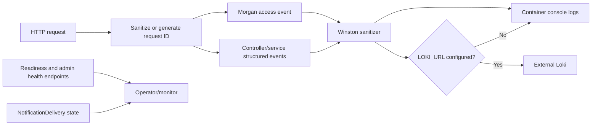

# Monitoring and logging design

## Implemented telemetry

| Signal | Source | Availability |
| --- | --- | --- |
| Request correlation | Incoming sanitized `X-Request-Id` or generated UUID, echoed in response | Every Express request |
| HTTP access log | Morgan method, redacted safe URL, status, size, latency, request ID | Winston console and optional Loki |
| Application events | Structured Winston info/warn/error calls | Console; optional Loki when configured |
| Sensitive-data redaction | Key-based and text-pattern sanitizer; maximum log text length | Winston formatting and selected error calls |
| Nginx access log | Method and normalized `$uri`, status, size, upstream and latency | Docker/Nginx logs; query string intentionally omitted |
| Readiness | MongoDB, Firebase, worker and required configuration details | `/health/ready` |
| Liveness | HTTP process response | `/health/live` |
| Notification counters | In-process enqueue/process/success/retry/dead-letter/recovery counters | Admin reminder-delivery health service/tests; resets on process restart |
| Durable delivery state | Queryable outbox status, attempts, leases, errors and expiry | MongoDB and hospital-scoped health endpoint |
| Container log retention | Docker `json-file`, 10 MB, three files per service | Checked-in Compose path |

## Event flow

## What is not implemented

No checked-in Prometheus endpoint, metrics backend, dashboard, alert rules, distributed tracing, error-tracking SDK, SIEM integration, synthetic monitoring, on-call schedule, or formal SLO exists. Loki transport is optional configuration, not proof that a Loki instance is deployed or retained.

## Recommended alert design

These are target controls, not current alerts:

| Condition | Suggested source |
| --- | --- |
| Public readiness unavailable | External probe plus `/health/ready` |
| MongoDB disconnect or required configuration missing | Readiness body and application error events |
| Redis degradation | `redis.*`, rate-limit fallback, queue publish, subscriber recovery events |
| Notification backlog/dead letters | `NotificationDelivery` counts by status/next attempt and age |
| Audit gap | `audit.persistence_failed` with `alert=audit_gap` or response `audit_recorded:false` |
| Authentication anomaly | Failed-login/lockout audit counts by normalized login/IP window |
| File/scanner/provider failure | Sanitized file, scanner, Twilio, Firebase and payment error classes |
| Cross-tenant denial spike | Authorization-denial metrics keyed by route/scope without patient identifiers |

Alert thresholds, paging ownership, retention, and runbook links require operational approval and remain open.

## Logging rules for future changes

- Preserve request correlation without accepting control characters or unlimited IDs.
- Never log raw passwords, OTP/TOTP, bearer/refresh/stream tickets, provider secrets, Firebase credentials, presigned URLs, report bytes, or patient names.
- Prefer stable event names and sanitized identifiers/error classes over full provider messages.
- Treat in-process counters as diagnostic only; do not use them as durable, cross-replica SLO evidence.
