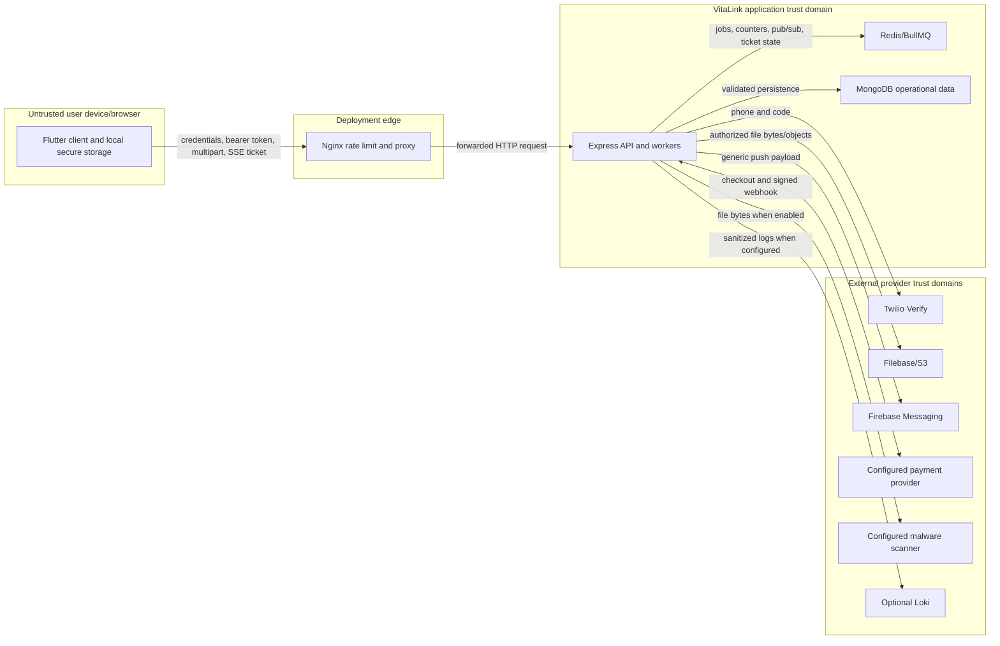

# Security controls and trust boundaries

## Trust-boundary diagram

## Implemented control matrix

| Threat/boundary | Implemented controls | Residual limitation |
| --- | --- | --- |
| Untrusted HTTP input | Zod validation, strict objects on sensitive schemas, JSON/upload limits, timeouts, centralized errors | OpenAPI schemas do not prove every runtime response branch |
| Cross-site/browser access | Explicit CORS allowlist in production, Helmet headers | Checked-in Nginx TLS is not active; actual TLS termination is unknown |
| Credential attack | Salted hashes, password policy/history/expiry, account lockout, IP auth limit, SMS OTP/admin TOTP | JWT algorithm is not explicitly pinned; operational secret rotation is not documented |
| Stolen token | Persisted revocable session, access token ID, refresh rotation/reuse detection, security generations, account/hospital checks | Access/refresh compromise response depends on logs and operator action; no user session-management UI is evident |
| Tenant data exposure | Hospital anchors, request-scoped admin scope, capability gates, clinical relationship checks, tenant-scoped file metadata | Some legacy records require backfills before strict anchors exist |
| File attack | MIME allowlists, size limits, magic-byte validation, SHA-256, UUID keys, optional fail-closed scanner, presigned reads, compensation | Malware scanning defaults off and requires an external scanner |
| SSE token leakage/replay | 30-second signed ticket, single-use JTI, session/token/security binding, query redaction | Process-local degraded ticket registry is per replica if Redis is unavailable |
| Notification privacy | Recipient eligibility checks, validity deadline, durable cancellation, generic push copy, token ownership | Firebase remains an external processor; formal data-processing terms are not in source |
| Payment forgery/replay | HTTPS provider URL requirement, server-owned amount/currency, HMAC payload, timing-safe compare, five-minute skew, provider event/session checks, idempotent settlement | Provider identity, key rotation, reconciliation job, and dispute process are unconfirmed |
| Audit/log leakage | Audit body allowlists, sanitized errors, structured log-key/text redaction, sensitive query redaction, no raw Nginx query string | Audit rows are written after most mutations; failure is surfaced as `audit_recorded:false`, so monitoring must detect gaps |
| Multi-instance races | Mongo transactions, unique/partial indexes, optimistic policy versions, leases/fences, Redis atomic Lua, idempotency keys | Mongo transactions require replica-set capability; live topology is unconfirmed |
| Dependency/config failure | Production/staging required-variable checks and readiness detail | No secret manager, SBOM, signing, runtime scanner, or automated rotation is defined |

## Sensitive data handling

Clinical and contact data are stored in MongoDB and report objects in S3-compatible storage. The application avoids patient names and detailed clinical content in provider push bodies, redacts known sensitive log keys, and authorizes file reads before issuing short-lived URLs. Source does not define encryption-at-rest settings for MongoDB, Redis, object storage, backups, or provider accounts; those are deployment responsibilities and open questions.

## Control plane

Maintenance mode blocks non-control-plane requests. Authentication, health, and system configuration remain available so operators can recover. Patient registration and notifications have separate feature flags. This is an application control, not a substitute for edge isolation or an incident-management process.

## Recommended, not implemented

- Enable and verify TLS with HSTS at the real public edge.
- Pin accepted JWT algorithms and document key rotation.
- Define backup encryption, restore tests, RPO/RTO, audit retention, and breach response.
- Add alerting for readiness failure, audit gaps, lockout spikes, dead letters, Redis degradation, scanner failures, provider webhooks, and cross-tenant denials.
- Add dependency/SBOM/container scanning and signed provenance to release workflows.
