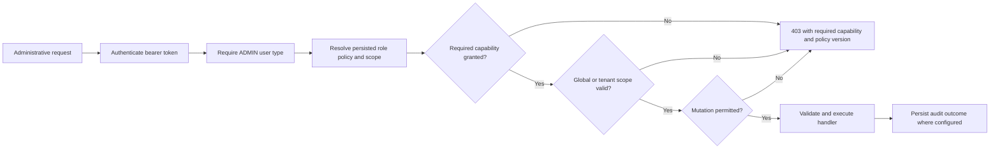

# User roles and permissions

## Clinical roles

| Role | Authentication | Allowed scope | Representative capabilities |
| --- | --- | --- | --- |
| Patient | Password; first-login SMS OTP when phone is pending | Own active account/profile within an active hospital | Profile, INR reports, dosage, calendar, health logs, doctor updates, notifications |
| Doctor | Password; first-login SMS OTP when phone is pending | Own profile and assigned patients within the same active hospital | Patient roster/create, care plan, report review, reassignment, notifications |

Doctor and Patient permissions are hard-coded through route middleware (`AllowDoctor`, `AllowPatient`) and service-level relationship/tenant checks. They are not editable through administrator role policy.

## Administrator roles

Administrator access uses fixed role keys and persisted V2 capability maps. The server resolves a request-scoped access snapshot before checking capability, global/tenant scope, and mutation permission.

| Role | Scope | Default capability boundary | Mutation rule |
| --- | --- | --- | --- |
| Application Admin | Global | All `platform.*` capabilities | Allowed where route requires a granted platform mutation capability; protected policy cannot be disabled |
| Hospital Admin | One assigned active hospital | `tenant.*` allowlist, individually enabled/disabled by persisted policy | Limited to granted tenant mutation capabilities and the assigned hospital |
| System Auditor | Global | Read-only subset of platform hospital, policy, audit, analytics, billing, and health reads | Hard read-only even if malformed policy data attempts to grant a mutation |

### Platform capabilities

`platform.hospitals.read`, `platform.hospitals.manage`, `platform.admin_accounts.read`, `platform.admin_accounts.manage`, `platform.role_policy.read`, `platform.role_policy.manage`, `platform.audit.read`, `platform.analytics.read`, `platform.billing.read`, `platform.billing.manage`, `platform.system_config.read`, `platform.system_config.manage`, `platform.system_health.read`, `platform.notifications.broadcast`.

### Tenant capabilities

`tenant.dashboard.read`, `tenant.doctors.read`, `tenant.doctors.manage`, `tenant.patients.read`, `tenant.patients.manage`, `tenant.patients.assign`, `tenant.accounts.status.manage`, `tenant.credentials.reset`, `tenant.audit.read`, `tenant.analytics.read`, `tenant.billing.read`, `tenant.billing.checkout`, `tenant.notifications.broadcast`, `tenant.operations_health.read`.

## Enforcement chain

## Route-level source of truth

The exact administrative method/path/capability/scope mapping is declared beside each route through `registerAdminRoute` in `backend/src/routes/admin.routes.ts` and `statistics.routes.ts`. The complete callable operation set is in [OpenAPI](../api/openapi.yaml); the route-parity validator prevents undocumented additions.
