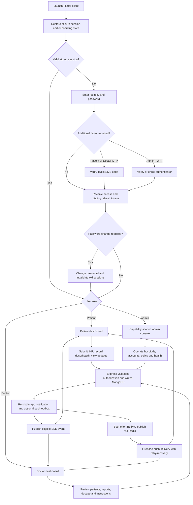
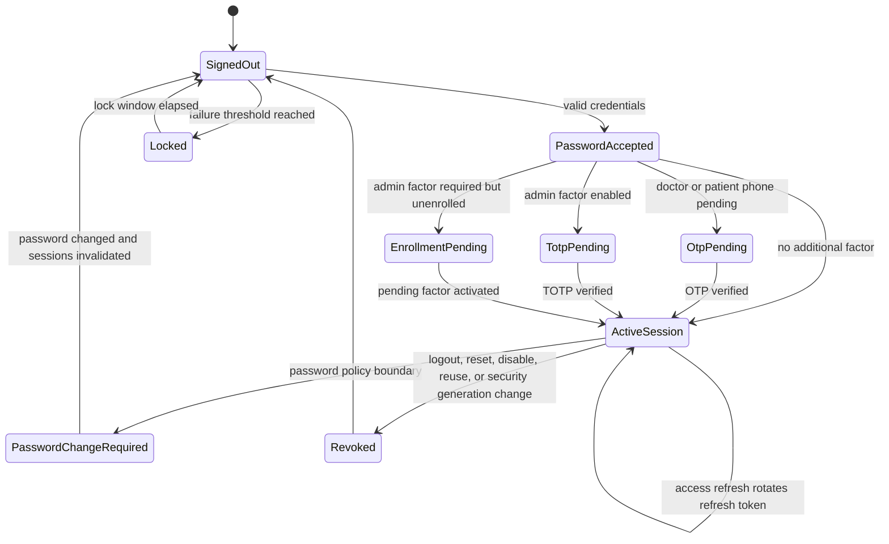
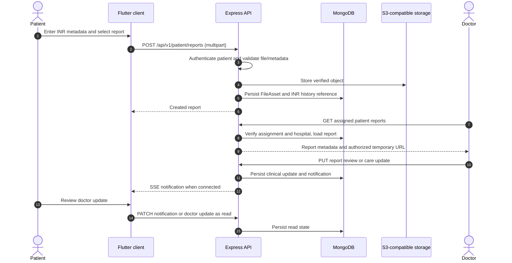

# Complete end-to-end application workflow

## User journey

## Authentication state

The enrollment transition is completed in Flutter login: `TOTP_ENROLLMENT_REQUIRED` loads `POST /auth/login/totp/enroll/setup` material and `POST /auth/login/totp/enroll/activate` issues the session after a valid authenticator code. Mid-session password expiry keeps the refresh session and is surfaced by the same `PasswordChangeRequired` state after `GET /auth/me`.

## Care coordination sequence

## Failure and recovery behavior

- A confirmed invalid refresh token clears the local session; transient refresh failures are surfaced without treating them as logout.
- A failed upload is compensated by retiring/deleting the object or marking its `FileAsset` failed, depending on the failure boundary.
- Redis failure does not erase a persisted push intent. MongoDB outbox rows remain available for the recovery poller.
- Reminder keys and delivery idempotency keys suppress duplicate work across retries.
- Hospital suspension, account deactivation, assignment conflict, expired clinical validity, or changed security generation fails protected work closed.
