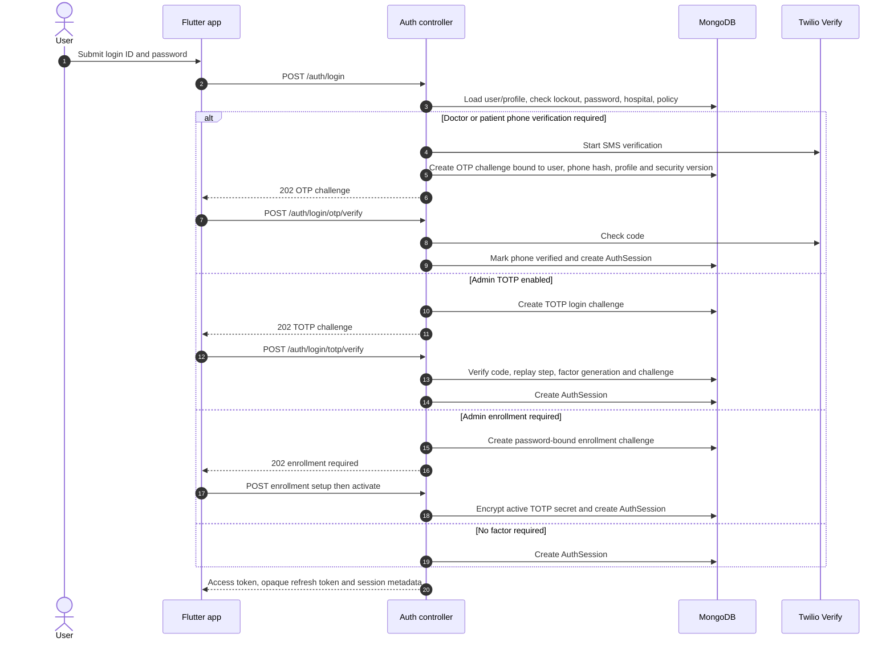
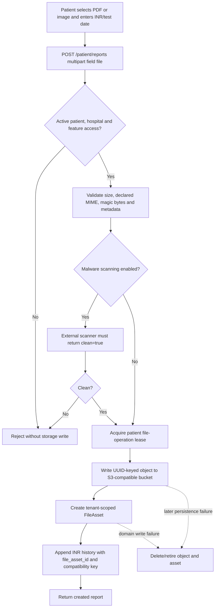
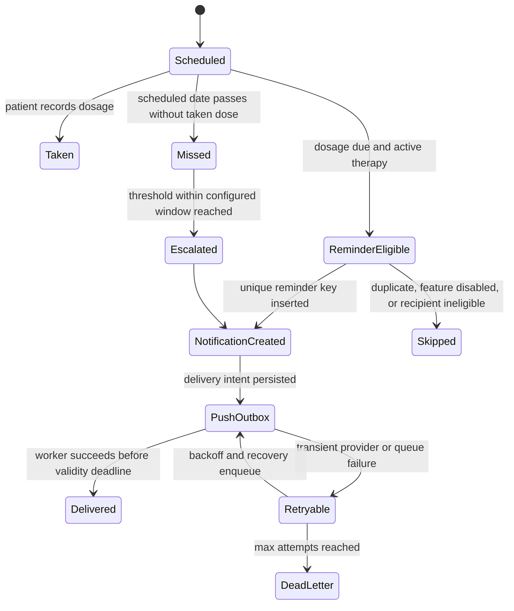
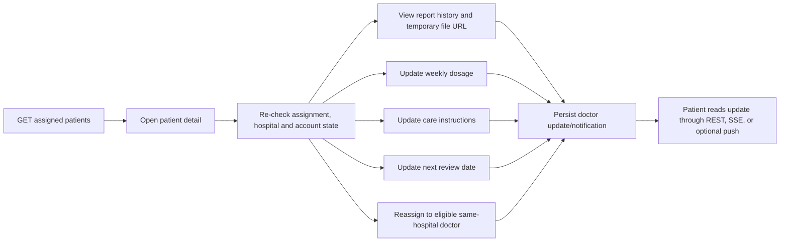
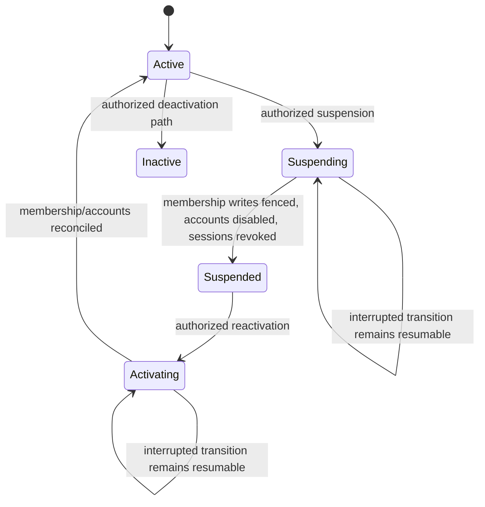
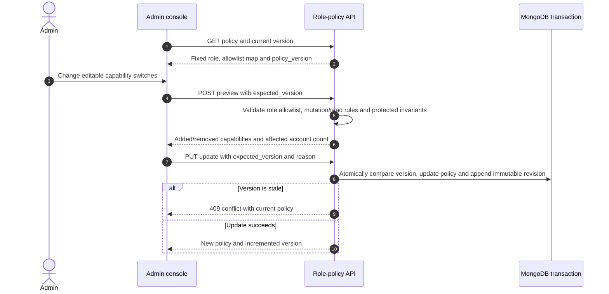
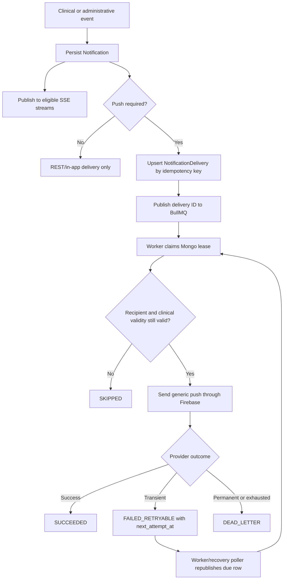
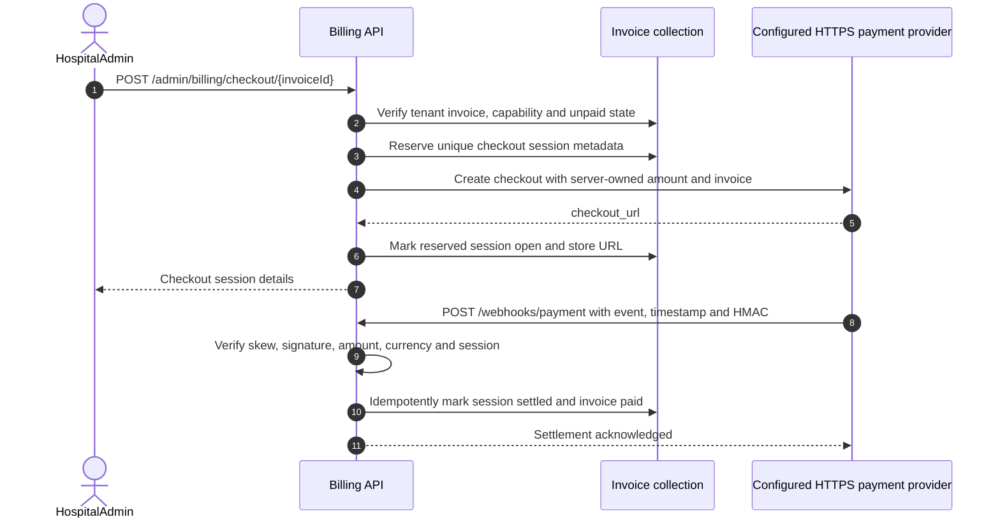
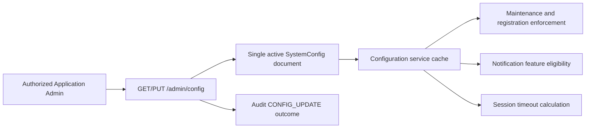

# Individual feature workflows

## Password, OTP, TOTP, and session issuance

The Flutter OTP form uses `resend_available_at`, remaining attempts, and max resends from the challenge payload. Resend stays disabled during cooldown or after the resend budget is exhausted; verify is blocked when the challenge is expired or has no attempts left.

!!! warning "Current client integration gap"
    The enrollment branch above documents the implemented backend contract. The current Flutter login repository handles `OTP_REQUIRED` and `TOTP_REQUIRED`, but not `TOTP_ENROLLMENT_REQUIRED`; see [INC-01](../reference/inconsistencies.md#inc-01-backend-admin-enrollment-is-not-handled-by-flutter-login).

## Patient INR report upload

The Update INR form rejects empty, non-decimal, zero, and values above 20 before `POST /patient/reports`, matching `reportSchema`.

## Dosage adherence and reminders

## Doctor review and care-plan update

## Hospital and account lifecycle

Hospital lifecycle uses a lease and monotonic generation. Doctor lifecycle and patient assignment use related leases/fences so stale workers cannot safely resume after losing ownership.

## Administrator role-policy change

## Notification delivery

## Billing checkout and settlement

The provider brand and live endpoint are configuration, not source-backed facts.

## Runtime configuration and feature flags

