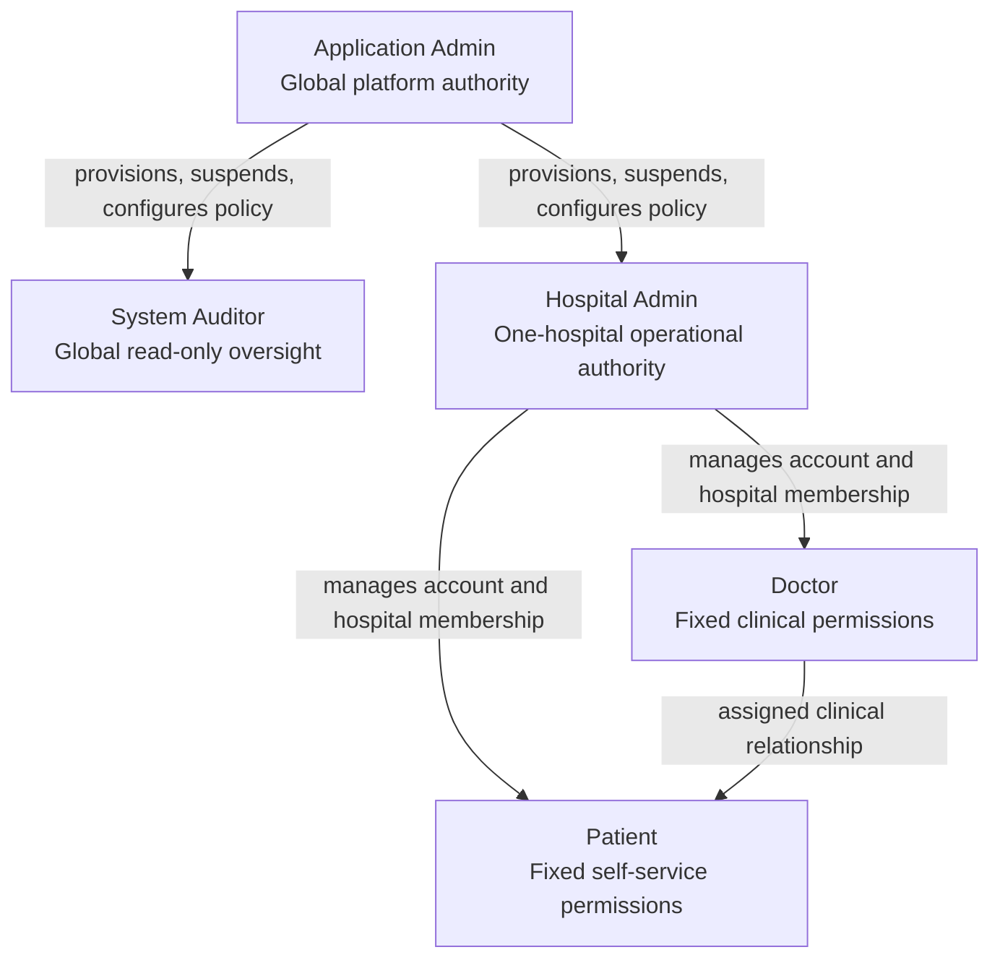

# VitaLink Administrative RBAC V2 Implementation Plan

Status: implementation-ready proposal, validated against the current `main` source tree on 2026-07-26.

This document plans the work only. It does not authorize a database migration, deployment, commit, push, or production policy change.

## 1. Feasibility verdict

The feature is implementable with the existing Node/Express/Mongoose backend and Flutter frontend. The repository already has useful foundations:

- Mongo-backed `RoleDefinition` records and a role-policy service.
- `requireAdminPermission` middleware on most `/api/admin/*` routes.
- Tenant-aware checks in `admin.service.ts`.
- A hard read-only guard for auditors.
- Session security-version and revocation support.
- Audit logging with PHI/credential minimization.
- Flutter admin repositories, query keys, role editor, and an API error model that distinguishes `403`.

This is not a small UI change. The current implementation has four structural issues that must be corrected together:

1. `/api/admin/users` mixes administrator, Doctor, and Patient accounts, while Hospital Admins can currently invite or re-role administrator-class users.
2. `SystemConfigPage` combines global configuration, system health, and the signed-in administrator's personal MFA.
3. `/api/statistics/*` checks only `ADMIN`, not the persisted role policy.
4. The blue-green deployment has no safe, rollback-compatible role-policy migration stage.

The implementation therefore needs an additive contract, a backend enforcement refactor, a permission-aware Flutter shell, and an expand-migrate-contract rollout.

## 2. Approved scope

### Included

- Fixed administrative roles only:
  - `app_admin`
  - `hospital_admin`
  - `auditor`
- Application Admin globally governs Hospital Admin and System Auditor accounts and policies.
- Hospital Admin manages operational Doctor and Patient account workflows only within its hospital.
- System Auditor is global and permanently read-only.
- Doctor and Patient clinical authorization remains fixed and outside editable RBAC.
- No per-user permission overrides.
- Permission-aware admin navigation, pages, and actions.
- Versioned, audited role-policy changes.
- Complete authorization coverage for admin, statistics, billing, audit, health, notification, and legacy administrative endpoints.

### Explicitly excluded

- Custom roles.
- Hospital-specific role definitions.
- Editable Doctor or Patient permissions.
- Individual permission overrides.
- Clinical-policy changes.
- Automatic Application Admin lifecycle management through the portal.
- Tenant-specific settings until a real tenant settings model exists.
- Routine Application Admin access to patient clinical records.

## 3. Target authority hierarchy



The arrows describe management or assignment relationships. They do not grant permissions through inheritance.

## 4. Non-negotiable authorization invariants

1. Backend authorization is authoritative; Flutter checks are UX only.
2. Every administrative request must resolve authentication, account state, fixed role, capability, scope, and resource relationship.
3. Missing policies, unknown capabilities, invalid role/scope combinations, and failed policy reads deny access.
4. Deny wins.
5. System Auditor mutations fail even if its stored policy is corrupted.
6. Hospital Admin always has exactly one active hospital and can never cross that boundary.
7. Hospital Admin cannot create, update, suspend, promote, reset MFA for, or otherwise manage administrator-class accounts.
8. Only Application Admin manages Hospital Admin and System Auditor accounts.
9. Application Admin policy-recovery capability cannot be disabled.
10. Portal actions cannot create or promote additional Application Admins. Additional Application Admin provisioning stays in the controlled bootstrap/operations path.
11. Doctor and Patient clinical permissions remain fixed.
12. Hospital Admin manages Doctor/Patient account state and assignment; it does not gain a clinical treatment role.
13. Role assignment or hospital-scope changes bump the target user's `security_version` and revoke active sessions.
14. Policy changes are enforced on the next backend request without relying on token claims.
15. Policy changes and their history are atomic; policy mutation requires transaction-capable MongoDB.

## 5. Capability catalogue

Use namespaced capabilities so global and tenant authority cannot be confused.

### Platform capabilities

| Capability | Meaning |
| --- | --- |
| `platform.hospitals.read` | Read hospital directory and operational metadata |
| `platform.hospitals.manage` | Create, update, suspend, or reactivate hospitals |
| `platform.admin_accounts.read` | Read Hospital Admin and System Auditor accounts |
| `platform.admin_accounts.manage` | Invite, update, suspend, restore, or reset MFA for Hospital Admins and Auditors |
| `platform.role_policy.read` | Read protected fixed-role policies and history |
| `platform.role_policy.manage` | Update Hospital Admin and Auditor policies |
| `platform.audit.read` | Read global operational audit events |
| `platform.analytics.read` | Read global, non-clinical operational analytics |
| `platform.billing.read` | Read platform billing and invoices |
| `platform.billing.manage` | Generate invoices and initiate supported billing operations |
| `platform.system_config.read` | Read global runtime configuration |
| `platform.system_config.manage` | Change global runtime configuration |
| `platform.system_health.read` | Read global service/dependency health |
| `platform.notifications.broadcast` | Send a global administrative broadcast |

### Tenant capabilities

| Capability | Meaning |
| --- | --- |
| `tenant.dashboard.read` | Read hospital-scoped operational dashboard |
| `tenant.doctors.read` | List and inspect hospital Doctor accounts |
| `tenant.doctors.manage` | Create and update non-clinical hospital Doctor account/profile data |
| `tenant.patients.read` | List and inspect hospital Patient accounts |
| `tenant.patients.manage` | Create and update non-clinical hospital Patient account/profile data |
| `tenant.patients.assign` | Administratively assign or reassign a Patient to an eligible same-hospital Doctor |
| `tenant.accounts.status.manage` | Suspend or restore eligible Doctor/Patient accounts in the hospital |
| `tenant.credentials.reset` | Reset Doctor/Patient credentials within the hospital |
| `tenant.audit.read` | Read hospital-scoped audit events |
| `tenant.analytics.read` | Read hospital-scoped operational analytics |
| `tenant.billing.read` | Read the hospital's invoices |
| `tenant.billing.checkout` | Initiate checkout for an eligible invoice belonging to the hospital |
| `tenant.notifications.broadcast` | Broadcast only to eligible users in the hospital |
| `tenant.operations_health.read` | Read hospital-scoped reminder/delivery health |

There is deliberately no `tenant.system_config.*` capability in V2. `SystemConfig` is currently global. Personal MFA is an authenticated self-service operation, not an RBAC capability.

## 6. Fixed role policy

### Application Admin

- Protected system role.
- Receives the complete approved `platform.*` set.
- Does not receive routine `tenant.doctors.*` or `tenant.patients.*` access.
- `platform.role_policy.manage` is immutable.
- Its policy is visible but not editable in the portal.

### Hospital Admin

- Globally defined fixed role with an editable set drawn only from `tenant.*`.
- Every account is scoped to one active hospital.
- Policy changes affect all Hospital Admins.
- Cannot receive platform capabilities.

### System Auditor

- Globally defined fixed role with configurable read-only `platform.*.read` capabilities.
- Always global; `hospital_id` must be absent.
- Cannot receive `.manage`, `.broadcast`, `.reset`, or other mutation capabilities.
- A hard backend `readOnly` invariant rejects all non-GET/HEAD/OPTIONS actions even if the stored policy is tampered with.

### Doctor and Patient

- Remove from the editable role-policy API and UI.
- Keep existing `UserType`, assignment, ownership, and clinical route rules unchanged.
- During the compatibility window, legacy Doctor/Patient `RoleDefinition` documents may remain unread by V2; remove them only in the contract release.

## 7. Backend design

### 7.1 Canonical capability definitions

Add one source of truth, for example:

- `backend/src/constants/admin-capabilities.ts`

It should export:

- Capability string constants/types.
- Allowed capabilities per fixed role.
- Default fixed-role policies.
- Read versus mutation classification.
- Human-readable labels/descriptions used by the API.
- Legacy permission translation.

Do not duplicate capability strings independently in routes, validators, services, OpenAPI, and tests.

### 7.2 Additive V2 role policy persistence

Do not change the legacy `RoleDefinition.permissions` contract in place during a rolling deployment. Old blue/green binaries expect the legacy `manage_*` keys. Add:

- `backend/src/models/adminrolepolicy.model.ts`
- `backend/src/models/adminrolepolicyrevision.model.ts`
- `backend/src/services/admin-role-policy.service.ts`

The V2 policy model contains:

- Strict `role_key` enum for the three administrator roles.
- Capability map using only V2 names.
- `protected: boolean`.
- `schema_version`.
- Explicit monotonic `policy_version`.
- `updated_by`.
- `change_reason`.
- Strict supported-capability validation.

The append-only revision model records:

Each revision records:

- Role key.
- Previous and new capability maps.
- Previous and new policy versions.
- Actor and actor role.
- Change reason.
- Affected active-account count.
- Request correlation ID.
- Timestamp.

Policy update, revision insertion, and the authoritative audit event must run in one MongoDB transaction. Do not use an unaudited standalone fallback for policy mutation. Local policy editing and integration tests must use replica-set MongoDB.

Keep the legacy `RoleDefinition` model and service as a compatibility adapter during Release A/B. Stop request-time permissive seeding once V2 enforcement is enabled. Under V2, a missing or invalid policy must deny access rather than recreate defaults.

### 7.3 Request-scoped access context

Add:

- `backend/src/services/admin-access.service.ts`
- `backend/src/types/admin-access.ts`
- `backend/src/middlewares/adminAccess.middleware.ts`
- `backend/src/authorization/admin-route-policy.ts`

After `authenticate` and `authorize([ADMIN])`, resolve one `AdminAccessContext` and attach it to the request:

```text
userId
role
scope: global | tenant
hospitalId?
hospitalCode?
permissions
policyVersion
readOnly
```

All following middleware must reuse the same request snapshot. Avoid the current pattern where middleware and service functions independently reread the actor and policy.

The service must validate:

- Active user.
- Valid `AdminProfile`.
- Valid fixed administrator role.
- Active hospital for Hospital Admin.
- No hospital for global System Auditor.
- Persisted policy shape.
- Immutable role restrictions.

The route-policy registry is the authoritative inventory of method, path, capability, scope, and mutation classification for `/admin` and `/statistics`. Protected routes must be registered through one helper rather than direct untyped `router.get/post/put/patch/delete` calls.

### 7.4 Permission and scope guards

Replace free-form `requireAdminPermission(string)` calls with typed guards:

- `requireAdminCapability(capability)`
- `requireAnyAdminCapability(capabilities)`
- `requireGlobalAdminScope()`
- `requireTenantAdminScope()`
- `requireAdminMutation()`

Service-layer resource checks remain mandatory:

- Hospital identity matching.
- Target user type.
- Target hospital.
- Doctor/Patient relationship and lifecycle constraints.
- Global-only resource restrictions.

### 7.5 Split administrator lifecycle from clinical account lifecycle

The current `/api/admin/users` contract is too broad. Introduce:

- `GET /api/admin/admin-accounts`
- `POST /api/admin/admin-accounts`
- `PUT /api/admin/admin-accounts/:id`
- `POST /api/admin/admin-accounts/:id/mfa/reset`

These endpoints:

- Require `platform.admin_accounts.*`.
- Are Application Admin-only.
- Accept only `hospital_admin` or `auditor`.
- Require an active hospital for Hospital Admin.
- Reject a hospital for System Auditor.
- Never target Application Admin accounts.
- Bump security version and revoke sessions after role/scope/account changes.

Keep Doctor and Patient lifecycle on their existing dedicated endpoints. Hospital Admin receives only the tenant-scoped capabilities needed for those endpoints.

Deprecate `/api/admin/users` during the compatibility release and remove it after the Flutter client migrates.

The existing batch and password-reset services must branch on target account class. A Hospital Admin must not be able to suspend, activate, reset credentials for, or batch-operate on a same-hospital administrator account merely because tenant membership matches.

Generic Doctor/Patient create and update contracts must not accept `password`, `is_active`, lifecycle status, MFA state, or other credential/security fields. Status changes and credential resets must use dedicated endpoints guarded by `tenant.accounts.status.manage` and `tenant.credentials.reset`. If a generic request contains a forbidden field, reject the entire request before any write; never silently ignore it or partially apply allowed fields.

### 7.6 Policy APIs

Add:

- `GET /api/admin/access/me`
- `GET /api/admin/role-policies`
- `GET /api/admin/role-policies/:roleKey`
- `POST /api/admin/role-policies/:roleKey/preview`
- `PUT /api/admin/role-policies/:roleKey`
- `GET /api/admin/role-policies/:roleKey/history`
- `POST /api/admin/role-policies/:roleKey/restore-preview`
- `POST /api/admin/role-policies/:roleKey/restore`

Rules:

- `/access/me` is available to any authenticated administrator.
- Policy read/history endpoints require `platform.role_policy.read`, so a configured System Auditor may inspect them read-only.
- Preview, update, restore-preview, and restore are hard-limited to Application Admin and also require `platform.role_policy.manage`; policy data must never make these mutations available to an Auditor or Hospital Admin.
- Only `hospital_admin` and `auditor` are editable.
- Update body contains the complete normalized capability map, `expected_version`, and required `change_reason`.
- Version mismatch returns `409` with the current policy.
- Preview returns added/removed capabilities, affected active accounts, impacted portal destinations/actions, warnings, and the current version.
- Restore selects a named prior revision but writes it as a new monotonically increasing policy version. It requires restore preview, `expected_version` compare-and-swap, a reason, a transaction covering policy/revision/audit writes, and the same recovery invariants as a normal update. Never restore through a direct database edit or rewind the version counter.

Do not put mutable permissions in JWTs. `/access/me` is the frontend authority, while every protected backend request resolves current policy.

### 7.7 Route conversion

Convert every route in:

- `backend/src/routes/admin.routes.ts`
- `backend/src/routes/statistics.routes.ts`

High-level mapping:

| Surface | Required capability/scope |
| --- | --- |
| Hospitals | `platform.hospitals.read/manage`, global |
| Admin accounts | `platform.admin_accounts.read/manage`, global |
| Role policies | `platform.role_policy.read/manage`, global |
| Doctors | `tenant.doctors.read/manage`, tenant |
| Patients | `tenant.patients.read/manage`, tenant |
| Patient assignment/reassignment | `tenant.patients.assign`, tenant plus same-hospital Doctor relationship |
| Doctor/Patient status | `tenant.accounts.status.manage`, tenant |
| Credential reset | `tenant.credentials.reset` or `platform.admin_accounts.manage`, based on target class |
| Audit | `platform.audit.read` or `tenant.audit.read`, scope applied in service |
| Statistics | `platform.analytics.read` or `tenant.analytics.read`, scope applied in service |
| Invoice generation/administration | `platform.billing.manage`, Application Admin only |
| Billing reads | `platform.billing.read` globally or `tenant.billing.read` for the actor's hospital |
| Hospital invoice checkout | `tenant.billing.checkout`, invoice must belong to the actor's hospital |
| Global config | `platform.system_config.read/manage`, global |
| Global health | `platform.system_health.read`, global |
| Reminder delivery health | `tenant.operations_health.read`, tenant |
| Broadcast | platform or tenant broadcast with recipient scope |
| Legacy routes | matching tenant capability until removed |

Add a route-policy coverage test that enumerates admin/statistics routes and fails if a route lacks an explicit capability declaration.

A companion static/AST test should reject direct route registration in the protected route modules unless it uses the typed registration helper. This avoids relying only on Express private router internals.

### 7.8 Preserve the clinical boundary

The current administrative Patient validators/services accept clinical fields such as diagnosis, therapy drug/start date, and target INR. V2 must remove those fields from Hospital Admin create/update contracts.

Hospital Admin may manage:

- Patient identity and contact/administrative demographics.
- Hospital membership.
- Account state.
- Eligible Doctor assignment.

Hospital Admin may not manage:

- Diagnosis.
- Therapy drug or therapy start date.
- Target INR.
- Dosage schedules.
- Clinical instructions.
- INR results or treatment decisions.

Those workflows remain on fixed Doctor/clinical routes. Strict validators must return `400` for administrative payloads containing clinical fields, and integration tests must prove no partial mutation occurs.

### 7.9 Correct global versus tenant services

- `SystemConfig` remains Application Admin-only because the current model has no `hospital_id`.
- Split personal TOTP endpoints from the Settings UI; they stay authenticated self-service.
- Keep notification recipient resolution tenant-scoped for Hospital Admin.
- Keep billing queries scoped by actor context.
- Add capability checks to all statistics routes while preserving their current tenant filters.
- Ensure global health never leaks connection strings, credentials, or internal topology to Auditors.
- Remove the unused `export_data` permission. If a real export is later introduced, create explicit read/export capabilities and endpoint-specific tests.

### 7.10 Audit events

Extend `AuditAction` with:

- `ROLE_POLICY_UPDATE`
- `ADMIN_ACCOUNT_CREATE`
- `ADMIN_ROLE_ASSIGN`
- `ADMIN_SCOPE_CHANGE`
- `ADMIN_ACCOUNT_SUSPEND`
- `ADMIN_ACCOUNT_RESTORE`

Keep middleware audit logging as defense in depth, but role-policy revision persistence is the authoritative history. Continue body/response minimization and never record passwords, TOTP secrets, tokens, notification free text, or PHI.

Mark policy updates as explicitly audited so the generic response-wrapping middleware does not create misleading duplicate `CONFIG_UPDATE` rows. Persist the request correlation ID already created by the application.

### 7.11 OpenAPI

Update `backend/docs/api/openapi.yaml` for:

- New capability names.
- Effective-access response.
- Role-policy preview/update/history.
- Admin-account endpoints.
- `409` policy conflicts.
- Deprecation of `/admin/users` and `/admin/roles`.
- Scope and role restrictions.
- Standard `403` error contract, including a safe `required_capability` and `policy_version`.

## 8. Flutter design

### 8.1 Effective access foundation

Add:

- `frontend/lib/features/admin/models/admin_access_model.dart`
- `frontend/lib/features/admin/data/admin_access_repository.dart` or extend `AdminRepository`
- `frontend/lib/features/admin/state/admin_access_controller.dart`
- `frontend/lib/core/widgets/admin/admin_access_scope.dart`

The project has no Provider/Riverpod dependency. Use a small `ChangeNotifier` plus `InheritedNotifier`, or the existing query cache, rather than introducing a new state-management package only for RBAC.

`AdminAccessModel` exposes:

- Role and scope.
- Hospital identity.
- Effective capabilities.
- Policy version.
- Read-only state.
- `can()` and `canAny()` helpers.

Do not persist capabilities as an authorization source in secure storage. Fetch them after admin session bootstrap and keep them in session memory/query cache.

Refetch:

- On admin dashboard entry.
- On app/web resume.
- After a policy update.
- After any authorization `403`.
- Periodically while the admin portal is active, with a modest interval, so stale UI converges while the backend remains immediately authoritative.

Never automatically retry a denied mutation.

### 8.2 Permission-aware admin shell

Refactor:

- `frontend/lib/core/widgets/admin/admin_scaffold.dart`
- `frontend/lib/features/admin/admin_dashboard_page.dart`

Replace positional fixed tabs with destination metadata:

```text
id
label
icon
readCapability
optional actionCapability
allowed scope
builder
```

Behavior:

- Render only readable destinations.
- Select the first allowed destination.
- If permissions change, move away from a now-denied destination.
- Guard direct page construction as well as navigation visibility.
- Show a dedicated access-denied state, not an empty list or raw exception.
- Hide mutation actions when only read capability exists.
- Display a persistent read-only explanation for Auditors.

Do not filter a numeric tab list and continue using its index. Use stable destination IDs. Replace the eager `IndexedStack`, which currently constructs hidden pages and starts their API calls/timers, with a lazy cache that builds only the selected/previously visited accessible destinations and removes cached destinations when access changes.

The dashboard must load widgets independently by capability. A denied health widget must not make the whole dashboard fail.

### 8.3 Split mixed admin surfaces

#### Accounts

Replace `UserLifecyclePage` with an Application Admin-only administrator accounts page that lists only Hospital Admins and System Auditors. Doctor and Patient lifecycle stays on their dedicated pages.

The account form must:

- Offer only Hospital Admin and System Auditor.
- Require an active hospital only for Hospital Admin.
- Never offer Application Admin.
- Explain that role/scope changes sign the target out.

#### Security versus platform settings

Split `SystemConfigPage` into:

- Personal Security/MFA: available to every signed-in administrator.
- Platform Configuration: Application Admin-only.
- Platform Health: Application Admin and configured read-only Auditor.
- Hospital Operations Health: Hospital Admin with tenant health permission.

This prevents Hospital Admin from loading or mutating global settings merely to reach personal MFA.

### 8.4 Access Control page

Replace `RolesRbacPage` with `AccessControlPage`. Application Admin receives the editable experience; a System Auditor configured with `platform.role_policy.read` receives the same policy and history information in a strictly read-only experience. Hospital Admin has no access.

Show:

- Fixed hierarchy.
- Locked Application Admin policy.
- Editable Hospital Admin policy.
- Application Admin-editable, read-only capability policy for System Auditor.
- Doctor and Patient as informational fixed clinical roles, not permission controls.
- Assigned active-account counts.
- Policy version and last change.

Group capabilities into operational areas. Use plain labels and descriptions instead of raw keys.

Save flow:

1. Edit locally.
2. Request preview.
3. Show added/removed capabilities, affected accounts, and warnings.
4. Require a reason.
5. Confirm once.
6. Submit with expected version.
7. Refresh policy/access queries.
8. Preserve the draft on network or `409` conflict.

The read-only Auditor view must not render editable controls, preview/save/restore actions, or mutation requests. Application Admin history includes a restore action that always follows the restore-preview and reason flow; it never rewrites history in place.

Extend `ApiException` with an explicit conflict kind and safe structured details, or refetch the current policy after `409`. The UI must show the local draft versus the new server policy without discarding the administrator's work.

### 8.5 Page/action conversion

Audit every mutation control in:

- `admin_console_pages.dart`
- `doctor_management_page.dart`
- `patient_management_page.dart`
- `billing` UI
- `notification_broadcast_page.dart`
- `audit_logs_page.dart`
- `analytics_dashboard_page.dart`
- `system_config_page.dart`
- shared admin dialogs

Each page needs separate read and action checks. Do not treat page visibility as authorization for every button.

Before assigning multiple frontend writers, extract the large `admin_console_pages.dart` and `system_config_page.dart` surfaces into owned files. At minimum separate Hospital Management, Administrator Management, Access Control, Billing, Account Security, Platform Configuration, and Health. This is a merge-safety and maintainability prerequisite, not a visual rewrite.

### 8.6 Accessibility and recovery

- WCAG AA contrast.
- Keyboard-operable controls.
- Screen-reader labels for permission state.
- Do not rely on color alone.
- Visible focus state.
- Skeletons for policy/page loading.
- Preserve unsaved policy edits through recoverable errors.
- Explain access denial in plain language and name the responsible administrator.
- Responsive layout at phone, tablet, and desktop widths.
- No raw backend stack/error text.

## 9. Migration and backward compatibility

Add:

- `backend/src/scripts/migrateAdminRbacV2.ts`
- `migrate:admin-rbac-v2` and production script entries.

The script defaults to dry-run and requires `--execute` to write. Add `--verify` for post-migration invariants and a migration ID/source snapshot hash. If rollback automation is supplied, it may operate only during the compatibility window and must restore a named migration snapshot rather than infer prior state.

During the additive release, stop writing the legacy `AdminProfile.permission` field. After compatibility cleanup, make `admin_role` required with no default; the current default of `app_admin` is too dangerous for malformed profile creation. The operations-only bootstrap must continue to set `app_admin` explicitly.

### Preflight report

Report without changing data:

- Existing role definitions and unsupported keys.
- Active accounts by administrator role.
- Tenantless Hospital Admins.
- Auditors that currently carry a hospital.
- Missing or inactive hospitals.
- Application Admin count and recovery status.
- Proposed legacy-to-V2 capability mapping.
- Documents that would be added, changed, retained for compatibility, or later removed.

Do not automatically turn a hospital-scoped Auditor into a global Auditor because that expands access. Fail it closed and require an Application Admin to explicitly approve the global conversion.

### Conservative legacy translation

- Application Admin: seed protected platform policy.
- Hospital Admin:
  - `manage_doctors` -> tenant doctor read/manage.
  - `manage_patients` -> tenant patient read/manage.
  - `view_audit` -> tenant audit read.
  - `manage_billing` -> tenant billing read and tenant billing checkout.
  - `manage_users` -> tenant credential reset only; never administrator management.
  - `manage_system` must not map to global configuration; at most map to tenant broadcast/operations health if those existing values are intentionally preserved.
- Auditor:
  - Translate only existing read intent.
  - Never translate a mutation permission.
- `export_data`: no mapping until an export endpoint exists.

### Expand-migrate-contract releases

#### Release A: expand

- Backend understands legacy and V2 keys.
- Add V2 models, fields, APIs, translation, and route metadata.
- Preserve legacy fields/documents for compatibility, while making this V2-aware release the minimum safe backend rollback target after enforcement begins.
- Deploy no destructive migration.

#### Migration

- Run dry-run in production.
- Review anomalies.
- Confirm and record the authoritative backend, database, region, and deployment owner.
- Create a backup of affected collections and record its immutable backup ID and timestamp.
- Rehearse and pass the documented restore procedure against staging data.
- Name the rollback decision owner and the operator who will execute it.
- Archive the reviewed dry-run report before `--execute`.
- Execute additive migration.
- Run `--verify` after execution and archive the policy/account/scope invariant report.

#### Release B: adopt and enforce

- Deploy permission-aware Flutter frontend.
- Switch admin/statistics routes to V2 enforcement.
- Keep compatibility reads for the old frontend during the defined window.
- Monitor denials, policy read failures, conflicts, and cross-tenant rejections.

#### Release C: contract

- Remove legacy `manage_*` translation.
- Remove Doctor/Patient role-definition documents.
- Remove legacy `AdminProfile.permission`.
- Remove deprecated `/admin/users` and `/admin/roles` contracts.
- Run only after the Release A compatibility rollback window is formally closed and the retained backup/restore evidence is revalidated.

The current blue-green deploy script does not run migrations. Do not insert an automatic destructive migration into container startup. Run the reviewed dry-run/execute operation as a separate controlled deployment step.

Before any rollout, identify the authoritative production backend and database. The repository currently contains EC2 backend CD while the APK/Vercel configuration points clients at a Render backend. Migration ownership, smoke-test URLs, rollback owner, and the actual database must be resolved explicitly; do not infer the production target from one workflow.

## 10. Test and validation plan

### 10.1 Backend unit tests

Add focused tests for:

- Capability validation and normalization.
- Legacy translation.
- Fixed-role allowlists.
- Immutable Application Admin recovery.
- Immutable Auditor read-only behavior.
- Access-context resolution.
- Missing/corrupt policy fail-closed behavior.
- Optimistic concurrency.
- Preview diffs and affected-account counts.

### 10.2 Backend integration tests

Use replica-set MongoDB fixtures for policy-update transactions.

For every protected endpoint verify:

- Application Admin allow/deny behavior.
- Hospital Admin capability allow/deny behavior.
- Hospital Admin same-tenant enforcement.
- Cross-tenant denial.
- Auditor configured read access.
- Auditor denial for every representative mutation.
- Doctor/Patient denial on admin APIs.
- Disabled account/hospital denial.
- Hospital Admin denial for administrator targets across invite, update, batch, credential reset, MFA reset, suspend, and restore.
- Strict rejection of clinical Patient fields on administrative create/update endpoints, with no partial write.
- Strict rejection of status, credential, password, and MFA fields on generic Doctor/Patient create/update endpoints, with no partial write.
- Immediate policy enforcement.
- Role/scope change session invalidation.
- Atomic policy revision history.
- Policy restore preview, expected-version conflict, new-version creation, recovery invariant, transaction rollback, and audit behavior.
- Audit minimization.

Add a route-coverage test that fails when a new admin/statistics route has no declared authorization metadata.

### 10.3 Flutter tests

Add:

- Model parsing tests.
- Access-controller refresh/error tests.
- Navigation visibility tests for each fixed role.
- Direct-page denial tests.
- Read-only action-hiding tests.
- Access Control editable App Admin and read-only Auditor tests.
- Access Control draft, preview, restore-preview, restore, success, network failure, and `409` tests.
- Admin account form role/scope tests.
- System settings/security surface separation tests.
- Responsive widget tests at phone/tablet/desktop widths.
- Semantics tests for permission controls and denial states.

### 10.4 CI changes

Backend CI already builds, lints OpenAPI, audits dependencies, and runs Jest. Add the new focused/integration tests to the existing suite and ensure the runner has transaction-capable replica-set Mongo.

Add a frontend CI workflow that runs:

```powershell
flutter pub get
flutter analyze
flutter test
```

The current APK and web workflows build artifacts but do not provide a dedicated analyze/test gate.

### 10.5 Local validation commands

Backend:

```powershell
cd C:\Projects\vitalink_ip_lab\backend
npm.cmd run build
npm.cmd run lint:openapi
npm.cmd test -- --runInBand tests/admin-access-unit.test.ts
npm.cmd test -- --runInBand tests/admin-rbac-integration.test.ts
npm.cmd test -- --runInBand tests/statisticscontroller.test.ts
```

Migration preview:

```powershell
cd C:\Projects\vitalink_ip_lab\backend
npm.cmd run migrate:admin-rbac-v2 -- --dry-run
npm.cmd run migrate:admin-rbac-v2 -- --verify
```

Flutter:

```powershell
cd C:\Projects\vitalink_ip_lab\frontend
flutter analyze
flutter test
```

If Testcontainers reports `Could not find a working container runtime strategy`, integration validation is blocked, not passed. Run it in Docker-enabled CI or a correctly configured local replica-set environment.

## 11. Multi-agent implementation strategy

Codex sub-agents share the same filesystem. Use strict, non-overlapping file ownership and no more than three sub-agents concurrently with the root coordinator.

### Rules

1. Root coordinator owns the approved API/capability contract and integration.
2. Freeze capability names and response schemas before parallel writing.
3. Only one agent may edit `admin.service.ts`.
4. Only one agent may edit `admin_dashboard_page.dart` and `admin_scaffold.dart`.
5. Only one agent may edit OpenAPI.
6. Test agents edit new/dedicated test files, not production hotspots.
7. Sub-agents do not stage, commit, push, migrate, or deploy.
8. Each agent reports completion by callback; the root does not continuously poll.
9. Root checks the full diff and runs integration gates between waves.
10. Independent reviewers are read-only and review actual diffs, not plans or summaries.

### Wave 0: contract freeze — root only

Deliver:

- Final capability catalogue.
- Role/capability allowlists.
- Endpoint-policy matrix.
- `/access/me`, policy, preview, and admin-account schemas.
- Compatibility/migration mapping.
- File ownership manifest.

Gate: no implementation agent starts until these contracts are written into shared types/OpenAPI fixtures or an agreed contract document.

### Wave 1: foundations — three agents in parallel

#### Agent A: backend authorization foundation

Owns:

- Capability constants/types.
- Role policy and revision models.
- Access-context service/middleware.
- Role-policy service/validators.
- Migration skeleton.
- Backend unit tests for the foundation.

Must not edit Flutter.

#### Agent B: Flutter access foundation

Owns:

- Admin access model/repository/controller/scope.
- Query keys and API parsing.
- Access-state unit tests.

Works against the frozen response fixtures; does not edit the admin shell yet.

#### Agent C: validation scaffolding

Owns:

- Endpoint-policy inventory test.
- Replica-set test harness.
- Migration fixture strategy.
- New test helper/factory files.
- CI feasibility notes.

Must not change production authorization behavior.

Wave 1 gate:

- Backend build.
- Foundation unit tests.
- Flutter targeted analysis/tests.
- Root contract/diff reconciliation.

### Wave 1.5: serialized frontend extraction

Use one frontend agent only to split `admin_console_pages.dart` and `system_config_page.dart` into the agreed surface files without changing behavior. Run Flutter analysis and targeted smoke/widget tests before proceeding. This gives later UX/test agents non-overlapping ownership and makes behavioral review possible.

### Wave 2: enforcement and UX — three agents in parallel

#### Agent D: backend lifecycle and service enforcement

Exclusive owner of `admin.service.ts` during this wave.

Implements:

- Admin-account split.
- App Admin-only admin lifecycle.
- Hospital Admin tenant Doctor/Patient lifecycle.
- Role/scope session invalidation.
- Service-layer scope enforcement.

#### Agent E: backend routes, statistics, config, and notifications

Owns non-overlapping route/controller/statistics/config/notification files.

Implements:

- Typed route guards.
- Statistics coverage.
- Global config restriction.
- Health split.
- Broadcast capability/scope enforcement.

Root performs final edits to shared `admin.routes.ts` if ownership would otherwise overlap.

#### Agent F: Flutter shell and surface conversion

Owns:

- Admin dashboard/scaffold.
- Permission-aware destinations.
- Accounts page.
- Access Control page.
- System Security/Configuration/Health split.
- Page/action gating.

Must not touch the user's unrelated local changes.

Wave 2 gate:

- Backend build.
- Focused backend integration suites.
- Flutter analyze.
- Focused Flutter widget tests.
- OpenAPI contract comparison.

### Wave 3: tests, docs, and review

#### Agent G: backend verification

- Completes role-by-endpoint matrix tests.
- Runs tenant isolation, session invalidation, transaction/history, audit, and migration tests.
- Reports exact pass/fail/blocked status.

#### Agent H: frontend verification

- Completes navigation/action/accessibility/responsive tests.
- Adds frontend CI.
- Runs targeted and full Flutter validation.

#### Agent I: independent security reviewer

Read-only review of:

- Every admin/statistics route.
- Permission/scope/resource enforcement.
- Escalation paths.
- Cross-tenant paths.
- Auditor mutation paths.
- Recovery/last-admin behavior.
- Migration and rollback safety.

The root fixes only still-valid findings, reruns affected gates, and requests a final read-only review.

### Final root integration

- Re-read every changed hotspot.
- Confirm no unrelated user changes were overwritten.
- Run backend build, OpenAPI lint, focused suites, full relevant suites, Flutter analyze, and Flutter tests.
- Run migration dry-run only against an approved non-production fixture.
- Produce a verification matrix with Passed, Failed, or Blocked status.
- Commit/push only after explicit user approval and completed independent review.

## 12. Delivery gates

| Gate | Required evidence |
| --- | --- |
| G0 Contract | Capability and endpoint matrix approved |
| G1 Backend foundation | Build and unit tests pass |
| G2 Enforcement | Role/endpoint and tenant-isolation integration tests pass |
| G3 Frontend | Analyze, model, navigation, action, and accessibility tests pass |
| G4 Contract | OpenAPI lint and frontend fixtures match |
| G5 Migration | Authoritative target confirmed; backup ID recorded; staging restore rehearsed; rollback owner named; dry-run reviewed; invalid accounts resolved |
| G6 Security review | Independent reviewer has no unresolved valid findings |
| G7 Staging | Fixed-role end-to-end scenarios pass with dedicated test accounts |
| G8 Production | Additive migration verified, health ready, denial/error metrics normal |
| G9 Contract cleanup | Rollback window closed before legacy removal |

## 13. Observability and rollback

Add structured metrics/logging for:

- Authorization decisions by role/capability/result, without PHI.
- Policy load failures.
- `403` counts by route and role.
- Cross-tenant rejections.
- Auditor mutation rejections.
- Policy conflicts.
- Policy version adoption.
- Migration anomaly counts.

Rollback rules:

- Release A is the V2-aware compatibility release and becomes the minimum permitted backend rollback image once Release B enforcement is enabled.
- Do not remove legacy fields/docs during the rollback window.
- A frontend rollback must still be protected by V2 backend enforcement.
- After any V2 policy change, prohibit rollback to pre-V2 authorization binaries: they ignore `AdminRolePolicy` and could enforce stale, broader `RoleDefinition` permissions.
- A Release B backend rollback may go only to the tested Release A compatibility image, which must read and conservatively enforce the current V2 policy. Retaining legacy fields alone is not a security boundary.
- Rehearse Release B-to-Release A rollback in staging, including a restrictive policy change, before production adoption.
- If policy migration verification fails, stop before switching enforcement.
- Never "fix" a failed migration by granting broad defaults.

## 14. Current verification status and environmental blockers

- Backend TypeScript build: passed during this planning review.
- Targeted Flutter analysis for admin/auth/navigation files: passed.
- Existing focused admin Flutter tests: 5/5 passed, but they do not cover RBAC.
- OpenAPI lint: passed with an existing warning baseline; passing lint alone does not prove route-policy completeness.
- Local Docker client exists, but the Docker Desktop Linux daemon was unavailable during this review.
- Docker/Testcontainers integration tests are therefore currently blocked locally, not passed.
- No migration, staging call, deployment, commit, push, or production write was performed.

Add `docker info` as an explicit preflight for integration runs. Use the repository's established replica-set Testcontainers pattern for transaction tests rather than weakening atomic policy/history behavior.

## 15. Acceptance matrix

| Scenario | App Admin | Hospital Admin | System Auditor |
| --- | --- | --- | --- |
| Manage hospitals | Allowed | Denied | Denied |
| Manage Hospital Admin/Auditor accounts | Allowed | Denied | Denied |
| Edit Hospital Admin/Auditor policy | Allowed | Denied | Denied |
| Read role policy/history | Allowed | Denied | Configurable read-only |
| Manage Doctors/Patients | Denied in normal portal flow | Allowed only in own hospital when configured | Denied |
| Read tenant analytics | Global aggregate only | Own hospital when configured | Configurable global operational read |
| Read audit | Global | Own hospital when configured | Configurable global read |
| Mutate global config | Allowed | Denied | Denied |
| Broadcast | Global when allowed | Own hospital when configured | Denied |
| Manage own MFA | Allowed | Allowed | Allowed |
| Cross-tenant access | Global operational surfaces only | Denied | Read-only operational surfaces only |
| Clinical Doctor/Patient actions | Not granted by admin RBAC | Not granted by admin RBAC | Not granted |

## 16. Definition of done

The feature is complete only when:

- Every administrative/statistics endpoint has typed capability metadata.
- Every resource service enforces the correct global/tenant relationship.
- Hospital Admin cannot manage administrator-class accounts or roles.
- System Auditor is read-only under policy/database tampering.
- Doctor and Patient clinical policies remain unchanged.
- No unused permission is displayed.
- Flutter navigation, pages, and actions reflect effective access.
- Backend direct calls remain secure regardless of Flutter state.
- Policy updates are versioned, atomic, persistent, audited, and immediately enforced.
- Policy history can be restored only through an audited preview/CAS flow that creates a new version.
- Migration is dry-run-first and additive, with a recorded backup, rehearsed restore, and V2-aware minimum rollback image.
- All required gates have explicit evidence.
- An independent security reviewer has no unresolved valid findings.
